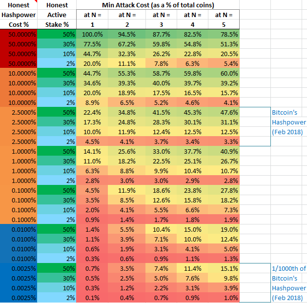

*Version: 0.2.0*

# Proof of Time-Ownership

PoTO is a consensus protocol for ordering cryptocurrency transactions as an alternative to pure Proof of Work. PoTO is a hybrid of Proof of Work and Proof of Stake that sets up a time-based race for PoS blocks rather than using quorums or voting to mint blocks. As far as I'm aware, this is the only PoS or hybrid proposal that doesn't use quorums of voters of some kind to mint blocks.

Proof of work is a solid and secure mechanism for determining a canonical order of transactions, but a PoW system’s security is linearly related to expenditure of resources (which directly translates to transaction fees) and such a system is susceptible to centralization pressure that leaves a significant risk of a 51% attack. Also, there is the possibility (granted one that seems unlikely) that the amount of fees that must be paid for PoW to maintain enough security could be more than can be extracted via a fee market.

Proof of Stake has the ability to decouple the security of the blockchain from resource expenditure, but has its own substantial problems including the issue of resolving competing chains (the nothing-at-stake problem), the ability to cheaply create a fresh blockchain that compares as longer to the “true” chain, the risk of validator quorum capture, stake grinding, the fact that requiring users locking up funds limits how many people can participate in minting blocks, among other issues.

Other hybrid protocols that mitigate some of these problems have the problems of potentially significantly increased network traffic, higher risk of censorship attacks (both apply to [PoA](https://eprint.iacr.org/2014/452.pdf), [Decred](https://docs.decred.org/research/hybrid-design/), [Memcoin2](https://www.decred.org/research/mackenzie2013.pdf), [Hcash](https://h.cash/themes/en/dist/pdf/HcashWhitepaperV0.8-edited.pdf), the [2-hop Blockchain](https://eprint.iacr.org/2016/716.pdf) and the related [TwinsCoin](https://eprint.iacr.org/2017/232.pdf)), are suceptible to a hashpower monopoly attack (described below), or don't allow a large fraction of coin owners to practically mint blocks (eg Decred and Memcoin2).

PoTO seeks to require a much smaller amount of hashpower for a given level of security without exibiting these problems by creating a hybrid protocol that doesn’t use lock-in staking or minter quorums, and doesn't require a PoW component for every block.

# Benefits

* Several orders of magnitude less hashpower required than pure PoW for a given level of security (ie cost of attack). 
* Everyone can participate in minting blocks with only the resources necessary to run a full node (with the same resource usage as Bitcoin)
* Drastically reduces the effect of miner centralization
* Increases the incentives to run a fully validating node
* No additional network traffic over Bitcoin

# Major Tradeoffs

* Lower cost of a building a fresh-chain or other long-range revision than pure PoW for a given level of short-range attack security
* Lower cost of a longer-chain attack than some other hybrid protocols (eg PoA) in the case that the cost of the honest hashpower is a significant fraction of the active stake

# Contents

- [Protocol](#protocol)
  * [Terms](#terms)
  * [Validating a Block](#validating-a-block)
  * [Follow-the-Satoshi](#follow-the-satoshi)
  * [Determining the Minter Progression](#determining-the-minter-progression)
  * [Determining Chain-length](#determining-chain-length)
  * [Confirmations and Transaction Finalization](#confirmations-and-transaction-finalization)
  * [Block Rewards](#block-rewards)
  * [Proxy Minting](#proxy-minting)
- [Protocol Extensions](#protocol-extensions)
  * [PoS-Absence Multiplier](#pos-absence-multiplier)
  * [Measuring Attack-cost and Fee-level Retargeting](#measuring-attack-cost-and-fee-level-retargeting)
  * [Multiple PoW algorithms](#multiple-pow-algorithms)
- [Analysis](#analysis)
  * [Security, Cost of Mining, and Cost of Attack](#security-cost-of-mining-and-cost-of-attack)
    + [Mitigating Long-range Revision Attacks](#mitigating-long-range-revision-attacks)
    + [Maximizing Active Stake](#maximizing-active-stake)
  * [Cost of Attack with the PoS-Absence Multiplier](#cost-of-attack-with-the-pos-absence-multiplier)
- [Potential Issues](#potential-issues)
    + [DDOS risk](#ddos-risk)
    + [Nothing at Stake](#nothing-at-stake)
    + [Time shifting](#time-shifting)
    + [Initial Centralization](#initial-centralization)
    + [Two-in-a-row minter problem](#two-in-a-row-minter-problem)
    + [Opportunistic mining halt](#opportunistic-mining-halt)
    + [Opportunistic chain switching](#opportunistic-chain-switching)
- [Comparisons](#comparisons)
  * [Comparison to pure Proof of Work](#comparison-to-pure-proof-of-work)
      - [Short-Range 51% attacks](#short-range-51%25-attacks)
      - [Long-Range 51% Attacks](#long-range-51%25-attacks)
      - [Fresh-chain and long-range attacks](#fresh-chain-and-long-range-attacks)
  * [Comparison to Ethereum's Casper Proof of Stake system](#comparison-to-ethereums-casper-proof-of-stake-system)
  * [Comparison to Proof of Activity](#comparison-to-proof-of-activity)
  * [Comparison to Decred's Consensus Protocol](#comparison-to-decreds-consensus-protocol)
- [Discussion and Review](#discussion-and-review)
- [Version History](#version-history)
- [License](#license)

# Protocol

This document describes the protocol using Bitcoin terms, but these techniques could be applied to pretty much any cryptocurrency.

The high level overview of PoTO is that Proof-of-Work (PoW) miners and Proof-of-Stake (PoS) minters race side-by-side for each block. PoS minters can mint for almost 0 cost, allowing anybody in the network to participate in block creation. PoW blocks are used to keep PoS minters in check by ensuring there is only one longest-chain (ie preventing the nothing-at-stake problem) and preventing PoS minters from stake-grinding (attempting to affect their probability of minting the next block).

There are two types of blocks that can be created: mined PoW blocks and minted PoS blocks. Mining PoW blocks works exactly how mining works in Bitcoin. Just like mining is a race to find a block with a hash below a certain value, minting PoS blocks is also a race against both miners and other minters. More and more addresses are given the ability to mint a block each second until either one of them mints a block or a PoW miner mines a block. This race incentivizes miners to release their blocks as soon as they find them and release minted blocks as soon as they become valid.

## Terms

**Minter** - An address that is used to mint a PoS block.

**Minter progression** - A time-bound progression of *minter* addresses that determines what addresses are valid minters at any given time. The address progression is determined using an algorithm known as follow-the-satoshi (defined below) along with a pseudo-random list of indexes.

**Address hash** - `hash(prevAddrHash + minterAddr + height)`. This is a hash of the previous PoS block's address hash (the first PoS block omits this) concatenated with the address that minted the current block and the current block height. Only PoS blocks (not PoW blocks) have address hashes.

**Minter signature** - A message and a signature of that message that together prove a minter attempted to mint a particular block. The message contains the 18-byte ASCII "mintingTheBlockNow" followed by the hash of the last block and a hash of the block being minted.

**Miner signature** - A message and a signature of that message required for a mined block to be valid. The message contains the 18-byte ASCII "miningThisBlockNow" followed by the height of the hash of the last block and a hash of the block being minted.

## Validating a Block

The *minter progression* is determined pseudo-randomly using the *address hash*. In this progression, X satoshi indexes are released each second, giving a chance for an active minter who owns one of those satoshi to mint a block. That number X is the inverse of the PoS difficulty, meaning that the difficulty is 1/X. The fewer satoshi indexes that are released each second, the higher the difficulty.

Proof of Work blocks are mined alongside the minted PoS blocks. The target block-time for PoW blocks should be the same as the target block time for PoS blocks, but the size of PoW blocks should probably be larger than the PoS blocks (since hashpower is critical for the security of the system).

A node will accept a block as valid if:

1. The block's timestamp is earlier than that node's current time

2. One of the following:

  2a. Its a PoS block and the address that signed the block (to mint it) owns a satoshi that has come up in the minter progression for that block before that block's timestamp
  2b. Its a PoW block and the block's hash is less than or equal to what the PoW difficulty requires (ie just like Bitcoin)

To mint a block, the block is hashed and that hash is signed with the minter's address along with a 

## Follow-the-Satoshi

The [follow-the-satoshi algorithm](https://www.decred.org/research/bentov2014.pdf) is any algorithm that assigns a unique index from 0 to X-1 to each of X relevant satoshi. For PoTO, the relevant satoshi are any satoshi that haven't been moved for at least 30 blocks (so people can't influence their probability of minting by sending their funds to a new wallet with a higher probability of being given minter rights) and is also part of an address that contains at least enough funds to cover the minter punishment if it becomes applicable (more info below). The order is completely arbitrary and does not need to be random (since the miner progression is random).

An example way to implement this is to take the UTXO set and order each output from oldest to newest, assign the first M indexes to the oldest unspent output of M satoshi, the next N indexes to the next oldest unspent output of N satoshi, etc. This would index the satoshi in order from oldest to newest.

## Determining the Minter Progression

The current minter progression is determined using the address hash of the last PoS block. This can be any algorithm that creates a deterministic pseudo-random list of satoshi indexes from 0 to N where N is the number of relevant satoshi indexed by the follow-the-satoshi algorithm, using the address hash as a seed.

## Determining Chain-length

When comparing two chains to see which is longer, the following formula will be used:

`Dwork*Dstake^(N*commonProportion)`

where

* `Dwork` is the accumulated PoW difficulty for the chain in question
* `Dstake` is the accumulated PoS difficulty for the chain in question
* `N` is an exponent that determines how heavily to weight accumulated PoS difficulty in comparison to accumuluated PoW difficulty
* `commonProportion` is the proportion of the chain common to both chains, given by `commonBlocks/maxBlocks`
    * `commonBlocks` is the number of common blocks that are the same in both chains
    * `maxBlocks` is the number of blocks in the relevant chain with the largest number of blocks

The `commonProportion` term of the formula makes it so when comparing two unrelated chains, only the accumulated proof of work difficulty is compared, and when comparing two chains that are mostly the same (a much more usual case), the chain length equation simplifies to the accumulated PoW difficulty multiplied by the accumulated PoTO difficulty. The reason this distinction is important is because if an attacker constructs a completely fresh chain with enough proof of work, they can control every address that owns coins on that chain, and so could maximize Dstake. If the length equation was only `Dwork*Dstake^N`, it would make it a lot easier for an attacker to create a completely fresh chain that would be seen as longer. Neutralizing `Dstake` when comparing fresh chains or mostly fresh chains makes it a lot harder for an attacker to successfully execute a fresh-chain attack.

Similarly, if the length equation only cared about `Dwork` (and got rid of the `Dstake^N` component entirely), it would mean that only proof of work would be securing the system, eliminating any benefits we'd get from PoS blocks. And of course if the length equation only cared about `Dstake`, it would be easy to successfully pull off a fresh-chain attack.

This chain-length equation is an extension of both those extremes, creating a gradient from one extreme to the other.

The `N` component allows the system to remain secure even if the attacker has a large super-majority of the hashpower. By weighting accumulated PoS difficulty more, it becomes possible to use a small fracion of the hashpower that Bitcoin currently has to achieve the same level of security. The appropriate value for N has yet to be determined, but should depend on the expected ratio between active stake and cost of hashpower. I suggest N=3 (similarly to PoA's similar proposal).

## Minter Punishment

The ability for PoS minters to mint on shorter chains in the hopes they become the longest chain (ie the nothing-at-stake problem) opens up the possibility of a Hashpower Monopoly Attack. 

To combat this, the PoTO protocol allows a minter or miner to include a proof, in their minted or mined block, that another minter attempted to mint a block on a chain where the most recent PoW block is different from the chain in which the proof is included. If a valid proof is included in a block, the minter punishment fine transferred from the address that minted the offending block to the address that mined or minted the block in which the proof was given, and if the address no longer contains enough coins to cover the fine, the minimum number of most recent transactions from that address will be invalidated in order to make enough coins available to cover the fine. 

The proof will only be valid if the difference in height of the block in which the proof is given and the offending block about which proof is given is 5 or less. This is so there is a tight upper bound on how long a receiver must wait to be sure that their received transaction can no longer be invalidated by a minter fine applied to the sender. Since 5 blocks at 2 minutes would be about 10 minutes, this would provide a similar confidence of finalization as one bitcoin confirmation.

The proof consists of a chain of *minter signatures* and *miner signatures* that lead back to a block on the current chain. Any minter included in that chain after a PoW block that isn't in the current chain (for a block within 5 blocks of the current block) is fined. 

This punishment should be able to both solve the nothing-at-stake problem as well as the Hashpower Monopoly Attack and does it in a way that doesn't require any locked-in stake so that there are no barriers to actively minting blocks.

## Confirmations and Transaction Finalization

A transaction should only be considered confirmed on the blockchain when the transaction has been confirmed by both a PoW block *and* a PoS block.

A transaction shouldn't be considered confirmed only by PoS blocks, since PoS blocks can mint on top of multiple conflicting chains. This shouldn't be a problem as long as people don't erroneously consider 1-PoS-confirmation transactions as confirmed.

Also, a transaction shouldn't be considered confirmed only by PoW blocks, since this could allow an attacker to double-spend via a 51% attack. While this attack is a lot harder than double-spending on someone accepting only PoS blocks as confirmation, it could be much easier than double-spending in today's bitcoin, since part of the point of PoTO is lowering the cost of mining (which by its nature reduces the hashpower in the system). This is why both PoW and PoS must be used to determine how finalized a transaction is.

## Block Rewards

Because the revenue from mining blocks directly affects how much work will be put into mining, most of the fees and coinbase rewards should go to miners so the amount of hashpower is nearly maximized for a given average fee-rate. But some incentive should be left to entice people to keep their addresses actively minting blocks. I’ll suggest the same thing [Charlie Lee suggested](https://bitcointalk.org/index.php?topic=102355.0) for Proof of Activity, that the PoW blocks earn 90% of the revenue, which would mean that a PoS block would be 10% the size of a PoW block (this ratio is up for debate).

## Proxy Minting

An empty address A can be used for minting PoS blocks on behalf of another address B as long as address A holds a rights-message signed by address B giving address A that right. The actual owner address B would be the one to receive any minted coins (not the minter address A). This would allow prospective minters to keep the keys securing their coins safely offline while still using their full balance to mint.

A proxy-minting-rights message could also include a fee amount that can be given to any address. It could also include an expirey block, after which the rights are revoked. This would allow users to allow a 3rd party to use their coins to mint blocks, in order for that 3rd party to get part of the reward as a fee. This could also facilitate pool minting. However, pool mining (giving someone else the power to mint blocks for you) might incentivize minter centralization and disincentivize users from running their own full node, so perhaps a feature for giving a fee to another address shouldn't in fact be added.

# Protocol Extensions

## Measuring Attack-cost and Fee-level Retargeting

The cost of an attack can be measured by measuring the cost of the hashpower and the active stake. The cost of the hashpower will tend toward miner revenues (fees and coinbase rewards) so that can be used as an approximation for the cost of the hashpower. The active stake can be calculated by using the stake difficulty, since that is the reciprocal of how many satoshi are released per second. The total number of satoshi divided by the number of satoshi released every PoS block (~ every 4 minutes) would give you the number of actively minting satoshi. Using these measurements, an attack-cost target could be chosen (some amount of bitcoins, or some percentage of bitcoins mined so far, etc) from which you could derive the revenue per block necessary to maintain that attack-cost. Then that information could be used to dynamically change the block size such that the block revenue will then continue to support the chosen target for attack-cost. This would  both make mining revenue more consistent and ensures a certain minimum level of security while also minimizing fees.

## Multiple PoW algorithms

In order to reduce mining centralization, multiple PoW algorithms could be used side by side. This would allow more seamless switch over from one algorithm to another if one of the algorithms is determined to be unfit at any point. It would also likely decentralize mining since different hardware and setup would be needed for each algorithm. While this extension is orthogonal to the general hybrid idea and its likely that centralization of the PoW mining wouldn't cause nearly as much of a problem as with pure PoW, it still seems prudent to minimize mining centralization. One coin that currently does this is MyriadCoin.

# Analysis

## Security, Cost of Mining, and Cost of Attack

The premise of PoTO is that the security of proof-of-work can combine with the security of proof-of-stake. Because of the chain-length equation, the proportion of hashrate and stake an attacker must minimally have to successfully perform an attack is inversely related. Having just over 50% of each will always work, but this is almost never the cheapest way to attack. For example at N=1, with 75% of the hashrate (3 times the honest hashrate) an attacker would only need 1/3 of the active stake, and at N=3, an attacker with 75% of the hashrate needs a little over 40% of the active stake.

The equation for finding the minimal cost of a successful longest-chain (*51%-style*) attack is:  

&nbsp;&nbsp;&nbsp;&nbsp;&nbsp;&nbsp;`HashCost^(1/(N+1)) * StakeCost^(N/(N+1)) * (N^(-N/(N+1)) + N^(1/(N+1)))`

where  
* *HashCost* is the cost of acquiring an amount of hashpower equal to the honest hashpower in the system
* *StakeCost* is the cost of acquiring an amount of coin equal to the honest actively minting coins in the system

For N=1, this is `2 * SQRT(StakeCost*HashCost)`.  
For N=3, this is approximately `1.754765 * HashCost^(1/4) * StakeCost^(3/4)`. 

The above shows how much it costs to successfully execute a longest-chain attack in PoTO for a given cost of hashpower and active stake (hashpower, stake, and attack cost all as percentages of the total coins). Note that Bitcoin currently cost about 2.5% of all bitcoins to successfully longest-chain attack it. Even with 1/1000th of Bitcoin's hashpower, PoTO with N=4 would cost more to attack than Bitcoin as long as it has more than 8% of the coins actively minting. See [PoTO-v0.2-attack-cost.xlsx](PoTO-v0.2-attack-cost.xlsx) for details.

### Derivation

The formula for calculating the minimum cost of attack is derived in the following way. In a successful attack, the attacker must be able to build a longer chain. We’ll assume this isn’t a long-range revision such that the `commonProportion` term is very close to 1 and can then simplify the chain-length equation by ignoring it.

&nbsp;&nbsp;&nbsp;&nbsp;&nbsp;&nbsp;Attack Inequality: `a*HashCost*(b*StakeCost)^N > HashCost*StakeCost^N`  
where  
* *a* is the multiple of honest hashpower the attacker has
* *b* is the multiple of honest active stake the attacker has

Also, the cost of a successful attack is the cost of acquiring the hashpower for the attack and the coins used for minting in the attack:

&nbsp;&nbsp;&nbsp;&nbsp;&nbsp;&nbsp;`costOfAttack = a*HashCost + b*StakeCost`
    
The Attack Inequality can be simplified to:  
&nbsp;&nbsp;&nbsp;&nbsp;&nbsp;&nbsp; `a*b^N > 1`  
This means that the minimum attack cost is where `a*b^N = 1`. So in the case of a minimum-cost attack:
&nbsp;&nbsp;&nbsp;&nbsp;&nbsp;&nbsp; `a = b^-N`  
From this we can simplify the `costOfAttack` to:
&nbsp;&nbsp;&nbsp;&nbsp;&nbsp;&nbsp; `StakeCost*b + HashCost*b^-N`  
Getting the derivative of this with respect to `b`:
&nbsp;&nbsp;&nbsp;&nbsp;&nbsp;&nbsp; `StakeCost - HashCost*N*b^(-N-1)`  
The cost of attack will be minimized when the derivative is 0:
&nbsp;&nbsp;&nbsp;&nbsp;&nbsp;&nbsp; `StakeCost - HashCost*N*b^(-N-1) = 0`  
&nbsp;&nbsp;&nbsp;&nbsp;&nbsp;&nbsp; `StakeCost = HashCost*N*b^(-N-1)`  
&nbsp;&nbsp;&nbsp;&nbsp;&nbsp;&nbsp; `StakeCost/(N*HashCost) = b^(-N-1)`  
&nbsp;&nbsp;&nbsp;&nbsp;&nbsp;&nbsp; `b = (StakeCost/(N*HashCost))^(1/(-N-1))`  
We can then solve for `a`:
&nbsp;&nbsp;&nbsp;&nbsp;&nbsp;&nbsp; `a = (StakeCost/(N*HashCost))^(-N/(-N-1))`  
&nbsp;&nbsp;&nbsp;&nbsp;&nbsp;&nbsp; `a = (StakeCost/(N*HashCost))^(N/(N+1))`  
Using these values for `a` and `b` under the condition of minimal cost of attack, we can obtain the above minimal cost of attack:
&nbsp;&nbsp;&nbsp;&nbsp;&nbsp;&nbsp; `HashCost*(StakeCost/(N*HashCost))^(N/(N+1)) + StakeCost*(StakeCost/(N*HashCost))^(1/(-N-1))`
&nbsp;&nbsp;&nbsp;&nbsp;&nbsp;&nbsp; `HashCost*StakeCost^(N/(N+1))*N^(-N/(N+1))*HashCost^(-N/(N+1)) + StakeCost*StakeCost^(1/(-N-1))*N^(1/(N+1))*HashCost^(1/(N+1))`
&nbsp;&nbsp;&nbsp;&nbsp;&nbsp;&nbsp; `StakeCost^(N/(N+1))*N^(-N/(N+1))*HashCost^(1/(N+1)) + StakeCost^(N/(N+1))*N^(1/(N+1))*HashCost^(1/(N+1))`
&nbsp;&nbsp;&nbsp;&nbsp;&nbsp;&nbsp; `HashCost^(1/(N+1)) * StakeCost^(N/(N+1)) * (N^(-N/(N+1)) + N^(1/(N+1)))`

### Mitigating Long-range Revision Attacks

Long-range attacks are where an attacker builds off the chain from a block height that was a long time in the past (some large percent of the blockchain ago, eg 50% of the blockchain ago, which would be a chain split off from a block mined more than 4 years ago). In pure proof-of-work, a long-range attack is always more expensive than a short-range attack, but in PoTO this isn’t the case. For example, a completely fresh-chain that is longer than the real/honest chain can be built without any existing coin ownership as long as the attacker has more hashpower than the network currently has. This might take an attacker months but could still actually be cheaper since no coins need to be obtained.

One way to mitigate this type of attack would be to simply incentivize higher miner revenue (eg through higher coinbase rewards or a smaller block size and therefore higher transaction fees) such that more honest hashpower enters the system. If the cost of the hashpower is higher, the cost of a long-range attack is higher.

A second way to mitigate this type of attack is for nodes to reject revisions if there is no common block (a complete fresh-chain) or if the highest common block is dated more than X days ago (eg 1 day). However this rule wouldn't help new nodes just entering the network, especially if they're being sybil attacked, and wouldn’t help SPV clients using an compromised SPV server that uses the new chain to show proof that a transaction exists in a valid chain with an appropriate length.

A third way to mitigate this would be hardcoded checkpoints in node and wallet software. This would be some data asserting that a block at a certain height has a certain hash. Since users must already either validate or trust their software, having a checkpoint like this would be simply another thing that should be peer-reviewed. Including this hard-coded checkpoint would completely eliminate the possibility of a long-range attack that split from the true-chain before the checkpoint, even for new entrants and SPV clients using a compromised SPV server.

### Maximizing Active Stake

Since the security of PoTO depends on how much of the owned coins are actively searching for a block to mint, maximizing this proportion is important. At a high proportion of active stake, getting to mint a block would be like winning a lottery: cheap to participate in but rarely rewarded. For example, if each of the world's ~7 billion people had equal stake, with a 2 minute target blocktime (4 minutes per PoS block) there would be about 130,000 blocks per year giving about 1/50,000 chance of winning the ability to mint a block each year if everyone participated.

If the ability to mint 1 block every 50,000 years isn’t enticing enough to people, we could increase the number of winners per block by requiring that a minted block be signed by N addresses. For example, if we chose N=500 the chance of minting a block would be 1/100 per year (ie you could expect to mint one block in a 100 year lifetime). This would probably be a lot more enticing since you could actually expect to win at some point.

Of course, the more people that share the block rewards, the less reward there is per person. If we assume people make about 10 transactions per day on average with a fee of something like mɃ0.1 per transaction (of on-chain fees associated with lightning channel rebalances or reopenings), that would be a reward per minter of about mɃ35. Not tiny, but not that big either.

So to really maximize active stake would require some experimentation and probably constant automated retargeting, similar to the above proposal for retargeting the block size. It’s also possible that because of the low cost of running a minter, people may do it regardless of the reward. In that case, it might simply be best to keep the protocol so only 1 signature mints a block and gains a more substantial reward in the unlikely event they win.

Note that requiring more signatures for each PoS block would *not* increase security directly. It would only increase security in-so-far as it increased the actively minting proportion of the total coins.

## Minter Punishment Collateral Damage

In the process of minting, some unlucky honest minters will mint on a chain they think will remain the longest but actually becomes beat out by another chain. This will mean some honest minters get fined for minting. However, the number of honest minters that have to pay fines should be very low compared to the number of honest minters that mint a block on the longest chain, so as long as the fine is lower than the revenue received from minting a block, the expected revenue from attempting to mint should be greater than 0. Since the fine probably doesn't need to be very big to be effective, the expected revenue from attempting to mint should be approximately the full minter revenue. How big the fine needs to be depends on the likelihood that dishonest minting on a shorter chain ends up in the dihonest minter's favor. So the size of the fine is up for debate.

Note that a minter punishment proof isn't valid if the minted block and the current block share the same most-recent PoW block because PoS blocks don't make much of a difference in whether an attacker can succeed in a Hashpower Monopoly Attack unless the attacker has a large fraction of the actively minting coins, and punishing minters that minted on top of another PoS block would double the collateral damage. Some analysis on how much stake an attacker would have to have to successfuly execute a Hashpower Monopoly Attack is needed to verify that this is safe.

# Potential Issues

### DDOS risk
Since the addresses that are able to mint the next PoS block are known as soon as the previous block is mined, those minters could be DDOSed (by competing minters and miners or by other malicious actors). Even if this does happen, while it would suck for the minters who come up first in the progression, it wouldn't significantly impact the network as a whole, since more and more potential minters would come up in the progression, requiring a DDOS attack to attack more and more targets as time went on. But even this could only happen if the IP address associate with a given coin address becomes known, and other measures could be taken to shield yourself from new traffic and only interact with existing connections.

### Nothing at Stake

Since there is no punishment or downside for minters to mint on top of all unresolved PoS chains, its likely every active minter that comes up in the progression will attempt to propagate their block, creating a number of competing PoS chains that will only resolve to a single chain when a PoW block is mined on one of the chains. In a pure proof-of-stake system, this is a problem since chains may keep branching and never resolve to one definitely-longest chain. However in PoTO, the PoW blocks serve as the deciding factor for which chain ends up being the longest. On average only 1 PoS block will happen between PoW blocks, and it would be very rare for 3 or more PoS blocks to happen between two PoW blocks. In any case, the nothing at stake problem is limited to being a problem only for the amount of time that has passed since the last PoW block - which is why a transaction shouldn't be considered confirmed until it has had at least one PoW confirmation.

### Time shifting
If actors are incentivized to alter network-time to their advantage, things could go wrong. People might want to pretend time is moving faster in order to see more minting rewards. However, hopefully there would be enough honest actors to counteract this. Shifting time backward (pretending time is moving slower) could give current potential minters more time to realize they're a potential miner, mine, and broadcast the next block, but any active minter is probably instantly aware of this already and minting a block would be a fast operation. Broadcasting can take some seconds, and so might provide some small incentive to time-shift backward. But even if network-time becomes shifted over time, the accuracy of network time isn't that important, only approximate consistency.

### Initial Centralization
Since only people who have coins can mint PoS blocks, those people would have an advantage in gaining new coins. This wouldn't be as much of a problem as in pure PoS protocols, since perhaps only ~10% of block rewards (and generated coinbase coins) would be given to minters. But if this is still a concern, the coinbase rewards for minters could be lowered or even eliminated if that was deemed appropriate.

### Two-in-a-row minter problem
It would sometimes happen where a minter's addresses come up multiple times in a short span, giving that minter the opportunity to choose which address to mint with (which would multiply their chances of minting the next block). While this would be very very rare for anyone who doesn't own massive amounts of coin, it would happen sometimes. However, this is limited by PoW blocks, which may be mined at any time with the same frequency as PoS blocks. If someone's address comes up in the progression twice in a short span, they risk losing the block entirely if a PoW block gets mined while they wait for a block minted by their second address to be accepted.

### Opportunistic mining halt
A miner may stop mining if one of their addresses is coming up soon enough in the miner progression to maximize their chances to mint the next PoS block. While this could theoretically happen, the opportunity to do this should be very rare and the only problem it would cause is a 1-block temporary PoW slow down. Also, the incentives don’t promote this behavior, since mining a PoW block would be much more lucrative than minting a PoS block.

### Opportunistic chain switching
Because of the minter behavior related to the nothing-at-stake issue, a miner may have a handful of chains to mine on top of and could choose the one that maximizes their chances to mint the next PoS block. This does give an advantage on minting PoS blocks to PoW miners, and a bigger advantage to larger pools (with more hashpower and coin ownership).

One way to minimize this effect is to make the blocktime for PoS blocks much longer than the blocktime for PoW blocks. For example, if the blocktimes were equal, then there should be a 50% chance of a second minter address to come up before a PoW block is found, at which point a miner would have two valid blocks to choose to mine on top of - doubling their chances of minting the next PoS block. But if PoS blocktime target were twice that of the PoW blocks, the likelihood is cut in half to 25% of the time.

### Prediction Attack

Because that a satoshi must have not moved in the last 30 blocks for it to be eligible for minting, as long as no one can predict all the minters for the next 30 blocks, no one can move their coins around to gain an advantage in minting. But if an actor could predict more than 30 blocks in advance, they could potentially be able to mint far more blocks than they would otherwise have been able to - potentially taking over the chain. To do this, an attacker would predict the *minter progression* for the block 31 blocks from now, then generate addresses until those addresses give them a high chance to mint that block.

Without also having control over more than 50% of the hashpower, this should be practically impossible, since the blockheights at PoW blocks will be mined change what the *Address Hash* will be in future blocks. An attacker would have to predict not only which blocks at which heights would be minted by which *exact* addresses, but would have to also know what block heights will be instead mined by PoW miners.

Howerver, if the attacker has greater than 50% of the hashpower, they could influence which PoW blocks are mined, and which aren't. If their prediction predicted that a PoW block would not be mined at a particular height but one was found, if the expected minter created and propagated their block (perhaps ahead of time), the attacker can mine on top of that minted block instead. And similarly, if a PoS block was minted where the attacker predicted a PoW block, the attacker could mine a PoW block at that height so that minters will then mint on top of it. The first correction is much less likely to be successful than the second correction, but both are frustrated by honest miners and minters who will be following the longest chain. An attacking miner can also withhold their hashpower for blocks at heights they expect a minted PoS block. How successful this kind of manipulation would be would depend on the distribution of addresses that are actively minting as well as how much hashpower and stake the attacker has. 

It seems unlikely that a prediction attack would be possible, even at 30 blocks. However, if it becomes clear this is a risk, the idle-period for satoshi eligible to mint can be increased to 300 or 3000 blocks without much reduction in coins eligible for minting. 

### Economic Attack

A "25% attack" or [economic attack](https://bitcoinmagazine.com/articles/selfish-mining-a-25-attack-against-the-bitcoin-network-1383578440/) is where a selfish mining (and/or minting) strategy can allow a particular entity to gain more than their fair share of blocks and thereby either run honest miners out of the system by reducing their revenue below protitable levels or incentivize miners to join their coalition of selfish mining. Both of these outcomes increase the risk of a single entity or coalition gaining enough hashpower/stake to control the chain and do things like double-spend. [A paper](https://arxiv.org/abs/1311.0243) was written that talked about how Bitcoin is susceptible to this attack no matter how much hashpower the attacker has and suggested a partial-fix that when a miner has two potential chains of equal length to mine on top of, they randomly choose the chain to mine on top of. The paper says this makes it so the attacker requires 25% hashpower and goes on to say that theoretically there is no fix that could make this requirement larger than 33%. PoTO likely has this same problem, tho rather than being 25% it would be half the usual requirement of combined hashpower and stake, in turn halving the cost of an attack - however this is just conjecture until further analysis is done.

### Hashpower Monopoly Attack

For hybrid systems that rely on bpth PoW and PoS, like PoA, an attacker with greater than 50% of the hashpower can push out other miners and monopolize the generation of PoW blocks. The attacker would gain more than 50% of the hashpower, then simply refuse to mine (and/or mint in the case of PoTO) on top of any chain that contains new PoW blocks created by another miner and instead selfishly mine (and mint) only on the chain where the last PoW block was their's. Since the blocks would be valid blocks propagated normally through the network, any honest minter would mint blocks on top of the attacker's blocks, giving the attacker's chain just as much PoS as the honest chain. However, it would have more PoW and therefore would be the longest chain. At that point, no other miner would be able to make money and would be forced to exit the network, giving the attacker 100% or almost 100% of the hashpower. The attacker could then use their near complete control of the hashpower to perform other attacks with very little coin ownership.

PoTO fixes this problem using minter punishments that incentivize minters to only mine on a chain if they think it will end up being the longest. This incentivizes rational minters to ignore shorter chains they have the opportunity to mint on, and only mint on top of the longest chain they're aware of (to minimize their chance of being punished).

### Minter Bribery

Because of the possibility of a Hashpower Monopoly Attack, it is important that honest minters only mint on top of the longest chain. If an attacker can bribe a significant fraction of minters to sign their blocks secretly, those minters could escape the possibility of being punished for dishonest mining while giving an attacker the ability to successfully execute the Hashpower Monopoly Attack. The likelihood of this seems incredibly small tho, since it would require active dishonesty by a large portion of coin holders, all of whom have a huge incentive to keep the system (and thus their money) secure and would risk that security by dishonestly minting, only getting rewarded for it if the attacker succeeded.

# Comparisons

## Comparison to Pure Proof of Work

#### Short-Range longest-chain Attacks

The requirements for a successful hidden-chain 51%-style attack on PoTO would be far larger than for PoW for a given amount of honest mining expenditures. To be successful against PoTO, an attacker would likely need many times the honest hashpower along with owning a significant fraction of the coins actively watching for minting opportunities. Because the longest chain is determined by multiplication of the PoW and PoTO accumulated difficulties, for N=3, even if a single miner managed to accumulate 90% of the hash power, they wouldn't be able to produce a significantly longer chain without also owning more than 32% of the active stake. 

For bitcoin as of Feb 2018, the cost of achieving 50% of the hashrate is about 440,000 btc (if using 1.9 million Antminer S9s) and 5% of all bitcoins is 900,000 btc. So assuming 5% of honest coin ownership actively mints in a PoTO system with N=3, the minimal cost of attack would be about 1.3 million btc. So at the same hashrate, the capital cost of longest-chain attacking Bitcoin would triple if it used PoTO. Even if the Proof-of-Work blocks were reduced to 1/100th the total reward (fees and coinbase), the cost of the attack would still be about what is currently is in bitcoin (even without considering the difference in recoverable value between hashpower and stake). Any increase in the proportion of active minters or total value of the currency would increase that capital cost substantially. 

#### Long-Range 51% Attacks

Pure proof of work simply doesn’t have a risk of long-range attacks, since short-range attacks are always cheaper. 

If we incentivized fees of 1/10th of what Bitcoin has, the total mining cost would also be 1/10th of what it currently is for Bitcoin. If we built a blockchain with 1/10th the accumulated difficulty that bitcoin has and 1/10th the hashpower, the cost of creating a whole new fresh chain at that level would be 1/10th of the cost of doing that for bitcoin. So where this would cost about 1 million btc for Bitcoin, with this hypothetical PoTO chain with 1/10th the hashpower it would only cost 100,000 btc. In both cases it would take about 280 days. (See [PoTOcostOfFreshChainAttack.xlsx](https://github.com/fresheneesz/proofOfTimeOwnership/raw/master/PoTOcostOfFreshChainAttack.xlsx) for calculations.)

So there is a tradeoff here, if we rely less on PoW security and more on PoTO security, mining can be much cheaper for the same cost of performing a short-range 51% attack, but it becomes cheaper to build a fresh-chain. 

Ways of mitigating this are mentioned above in the section titled "Mitigating Long-range Revision Attacks".

## Comparison to Ethereum's Casper Proof of Stake system

PoTO remains P2P & protocol-neutral. While [Casper](https://github.com/ethereum/research/blob/master/papers/casper-basics/casper_basics.pdf) has a minter class (aka stakers) and a node class, everyone is potentially a miner in PoTO. 

Since stakers can't use their coins, this makes it impossible for everyone to participate in Casper minting, and in practice this will likely mean that fewer people will bother to actually actively participate. In PoTO, minting can be done automatically anytime you have an online node without any downside, but in Casper you need to take manual actual to stake or unstake your coins. While this could theoretically be as easy as transferring money from a savings to a checking account (and then waiting weeks for the transition to happen), the extra complication there will definitely deter some people from participating or would at minimum prevent willing participants from participating with all their coins. The security of both PoTO and Casper depend on high participation in minting, and so PoTO allowing more people to practically participate would increase the cost of an attack potentially drastically by comparison.

Two primary attacks Casper goes to lengths to mitigate are long-range revisions (where a coalition of validators with ⅔ of a past validator set can create conflicting chains) and catastrophic crashes (where more than 1/3 of validators go offline). PoTO’s susceptibility to long range revisions is limited due to its use of PoW, tho higher than a pure PoW system. And  PoTO doesn’t have the problem of catastrophic crashes because it doesn’t use quorums (validator sets), and instead a new satoshi will be given the right to mint a block each second, allowing more and more of the address space to mine a block, meaning that the longer it takes for a block to be mined, the more people will be able to mint a block.

Casper attempts to solve the nothing-at-stake problem by using pre-staked ether and confiscating that ether if the validator owning that stake validates blocks on multiple competing chains. PoTO’s uses the same mechanism that Bitcoin uses to solve this problem: PoW blocks. A PoTO chain can allow multiple competing minted blocks, but only one will be mined on top of. 

Casper also requires a “proposal mechanism” and currently plans on using a PoW mechanism to do that. That proposal mechanism adds costs to Casper that aren’t discussed in the proposal, since they’re separate. PoTO is self-contained and doesn't need any external mechanism to operate properly.

## Comparison to Proof of Activity

[Proof of Activity (PoA)](https://www.decred.org/research/bentov2014.pdf) is a somewhat similar hybrid protocol, but rather than use PoW blocks and PoS blocks as separate entities, PoA requires that each block be validated by both proof of work and proof of stake.

PoA seems to have exceptionally good theoretical security against double-spending attacks, similar to PoTO, tho they didn’t give a formula for the minimum cost of attack and I haven’t derived it. (See [PoA-min-attack-cost.xlsx](https://github.com/fresheneesz/proofOfTimeOwnership/raw/master/PoA-min-attack-cost.xlsx).

However PoA potentially has significantly higher load on the network than either Bitcoin or PoTO. The protocol requires miners to usually mine multiple blocks until all N minters derived from one of those blocks are online. With N being 3 as suggested in the paper, this would take 8 blocks for 50% online stake. At 10% online stake, this would be 1000 blocks. At ~100 bytes per (empty) block, 1000 blocks would be 100kb. Not too bad, but it can certainly be significant network-wide overhead, especially if blocktimes are reduced (with blocksizes proportionally reduced, which would mean a higher percentage of network traffic would be unused [vs used] block headers). With slightly higher values for N, this problem increases exponentially. For example, with N=5 and 10% online stake, this would be a very unwieldy extra 10MB per block. By contrast, PoTO doesn’t have any significant extra network overhead. 

Furthermore, the cost of successfully executing a censorship attack is equal to basic PoTO for N=1, and much less than PoTO when N > 1. This attack would be performed by an attacker with greater than A times the honest hashpower and B times the honest online stake, where A > 1 (at least 50% of total hashpower) and B > 1/(A*N) (a potentially small fraction of online stake). The attacker would mine blocks, but not release them unless one of the attacker's addresses is one of the N winning stakeholders for that block.  When such a block is found, the attacker would release the block and wait until N-1 stakeholders sign the block, and then sign the block themselves as the Nth stakeholder putting in (or leaving out) any transactions they want, and mine only on top of that block. While a double-spend attack becomes exponentially more difficult as N grows, a censorship attack becomes proportionally easier to pull off as N grows. For example, at the suggested N=3, you only need 34% of the active stake along with 50% of hashpower, or 9% of the active stake with 88% of the total hashpower. This could be a significant limitation of PoA, since while a double-spend attack is terrible, a censorship attack is also unacceptable. This attack is costlier than pure PoW, but not as costly as it is in PoTO. An easy modification to PoA that would eliminate this lower-cost attack is to allow each of the N winning stakeholders for a block include up to 1/Nth of the bytes of transactions in the block. This way, each stakeholder would contribute some transactions to the block, and thus an attacker would need to control all stakeholders for a block in order to ensure that a transaction is censored.

PoA is also suceptible to the PoW Monopoly Attack, where an attacker gains more than 50% of the hashpower and monopolizes the generation of PoW blocks, pushing any other miner out of business. The attacker would gain more than 50% of the hashpower, then simply refuse to mine on top of any chain that contains new PoW blocks created by another miner and instead selfishly mine on the chain where the last PoW block was their's. Since the blocks would be valid blocks propagated normally through the network, any honest minter would mint blocks on top of the attacker's blocks, giving the attacker's chain just as much PoS as the honest chain. However, the attacker's chain would have more hashpower and therefore would be the longest chain. At that point, no other miner would be able to make money and would be forced to exit the network, giving the attacker 100% or almost 100% of the hashpower. The attacker could then use their near complete control of the hashpower to perform other attacks with very little coin ownership. Since blocks can't be created without a miner, I don't see a way to fix this problem in PoA without fundamentally changing the PoA protocol.

## Comparison to Decred's Consensus Protocol

Decred is somewhat similar to PoA, with some key differences including the need to buy stake "tickets" (similar to staking ether in Casper) and requires 3 of 5 block signers vs PoA's requirement that all N winners sign the block for it to be valid. Decred's support for stakepools enables and encourages centralization and discourages people from running their own full nodes (which is important for having a say in the case of a fork). Decred hasn't given any information on the cost of attacking the system, but it looks to be less costly than both PoA and PoTO. Decred has a censorship attack problem, where anyone with 51% of the hashpower can successfully censor transactions indefinitely even with no stake. Decred is also vulnerable to the PoW Monopolization Attack, just like PoA.

Discussion and Review
=====================

Please feel free to use the github issues as a forum for questions and discussing this protocol, as well as proposed changes to the protocol.

Version History
===============

* 0.2.0
	* Added the `N` component to the chain-length equation, which substantially boslters the security of PoTO for networks with a low amount of hashpower.
	* Added minter punishments
	* Added Minter Bribery attack
	* Removed PoA Extension and PoS-Absence Extension (since they are obsoleted when the N component of chain-length is greater than 1). Note that the PoS-Absence extension might still be useful, but its complicated and doesn't seem to add much additional security over using for example N=3.
* 0.1.2
	* Added analysis of a couple more attack vectors
	* Added PoA Extension section 
* 0.1.1
	* Added formula for the minimum cost of double-spend attack (and derivation)
	* Added PoS-Absence Extension
	* Changing block rewards such that miners get most of the fees
	* Adding section on feel-level retargeting
	* Adding the blockheight into the address hash and getting rid of the progression seed term
	* Lots of cleanup, better organization, and better more full explanations and analysis
* 0.1.0 - First version

License
=======
Released under the MIT license: http://opensource.org/licenses/MIT