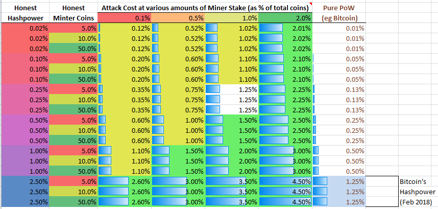

*Version: 1.0.0*  
*Status: Ready to Peer Review*

# Proof of Time-Ownership

PoTO is a consensus protocol for ordering cryptocurrency transactions as an alternative to pure Proof of Work. PoTO is a hybrid of Proof of Work and Proof of Stake that sets up a time-based race for PoS blocks rather than using quorums or voting to mint blocks. As far as I'm aware, this is the only PoS or hybrid proposal that uses chronological progressions to determine who wins the chance to mint a block.

## Problems with Current Solutions

Proof of work is a solid and secure mechanism for determining a canonical order of transactions, but a PoW system’s security is linearly related to expenditure of resources (which directly translates to transaction fees) and such a system is susceptible to centralization pressure that leaves a significant risk of a 51% attack. Also, there is the possibility (granted one that seems unlikely) that the amount of fees that must be paid for PoW to maintain enough security could be more than can be extracted via a fee market.

Proof of Stake has the potential to decouple the security of the blockchain from resource expenditure, but has its own substantial problems including the issue of resolving competing chains (the nothing-at-stake problem), the ability to cheaply create a fresh blockchain that compares as longer to the “true” chain, the risk of validator quorum capture, stake grinding, the fact that requiring users locking up funds limits how many people can participate in minting blocks, among other issues.

Other hybrid protocols that mitigate some of these problems have the problems of potentially significantly increased network traffic, higher risk of censorship attacks (both apply to [PoA](https://eprint.iacr.org/2014/452.pdf), [Decred](https://docs.decred.org/research/hybrid-design/), [Memcoin2](https://www.decred.org/research/mackenzie2013.pdf), [Hcash](https://h.cash/themes/en/dist/pdf/HcashWhitepaperV0.8-edited.pdf), are suceptible to two types of the mining monopoly attacks described later in the paper (at least PoA and Decred if not the others), the [2-hop Blockchain](https://eprint.iacr.org/2016/716.pdf) and the related [TwinsCoin](https://eprint.iacr.org/2017/232.pdf)), or don't allow a large fraction of coin owners to practically mint blocks (eg Decred and Memcoin2).

## Benefits

PoTO seeks to require a much smaller amount of hashpower for a given level of security without exhibiting these problems by creating a hybrid protocol that doesn’t use lock-in staking for minters (although it does for miners) or minter quorums, and doesn't require a PoW component for every block.

* Potentially 1 or 2 orders of magnitude less hashpower required, in comparison to pure PoW, for a given level of security (ie cost of attack).
* Everyone can participate in minting blocks with only the resources necessary to run a full node (with the same resource usage as Bitcoin)
* Increases the incentives to run a fully validating node
* No additional network traffic over Bitcoin (and less traffic than other hybrid solutions)

## Major Tradeoffs

* Lower cost of a building a fresh-chain or other long-range revision than pure PoW for a given level of short-range attack security
* Lower cost of a longer-chain attack than some other hybrid protocols (eg PoA) in the case that the cost of the honest hashpower is a significant fraction of the active stake

*Note that both of these are solved using versioned software checkpoints (see the section on *Mitigating Long-range Revision Attacks*).*

# Contents

- [Protocol](#protocol)
  * [Terms](#terms)
  * [Validating a Block](#validating-a-block)
  * [Follow-the-Satoshi](#follow-the-satoshi)
  * [Determining the Minter Progression](#determining-the-minter-progression)
  * [Determining Chain-length](#determining-chain-length)
  * [Minter Punishment](#minter-punishment)
  * [Miner-Stake](#miner-stake)
  * [Confirmations and Transaction Finalization](#confirmations-and-transaction-finalization)
  * [Block Rewards](#block-rewards)
  * [Proxy Minting](#proxy-minting)
- [Protocol Extensions](#protocol-extensions)
  * [Measuring Attack-cost and Fee-level Retargeting](#measuring-attack-cost-and-fee-level-retargeting)
  * [Multiple PoW algorithms](#multiple-pow-algorithms)
  * [Incentivizing full valiation by Proof of UTXO](#incentivizing-full-validation-by-proof-of-utxo)
  * [Switchover Extension](#switchover-extension)
  * [Length Normalization](#length-normalization)
- [Analysis](#analysis)
  * [Analysis of Miner-stake](#analysis-of-miner-stake)
  * [Security: The Minimum Cost of Attack](#security-the-minimum-cost-of-attack)
    + [Further Attack-Cost Analysis](#further-attack-cost-analysis)
  * [Mitigating Long-range Revision Attacks](#mitigating-long-range-revision-attacks)
  * [Maximizing Active Stake](#maximizing-active-stake)
  * [Minter Punishment Collateral Damage](#minter-punishment-collateral-damage)
- [Potential Issues](#potential-issues)
    + [DDOS risk](#ddos-risk)
    + [Nothing at Stake](#nothing-at-stake)
    + [Time shifting](#time-shifting)
    + [Initial and Long-term Ownership Centralization](#initial-and-long-term-ownership-centralization)
    + [Opportunistic mining halt](#opportunistic-mining-halt)
    + [Prediction Attack](#prediction-attack)
  * [Stake-grinding](#stake-grinding)
    + [Economic Hidden-chain Attack](#economic-hidden-chain-attack)
    + [Orphan-based Mining Monopoly Attack](#orphan-based-mining-monopoly-attack)
    + [Economic Mining Monopoly Attack](#economic-mining-monopoly-attack)
    + [Minter Bribery](#minter-bribery)
- [Comparisons](#comparisons)
  * [Comparison to Pure Proof of Work](#comparison-to-pure-proof-of-work)
      - [Short-Range longest-chain Attacks](#short-range-longest-chain-attacks)
      - [Long-Range 51% Attacks](#long-range-51%25-attacks)
  * [Comparison to Ethereum's Casper Proof of Stake system](#comparison-to-ethereums-casper-proof-of-stake-system)
  * [Comparison to Proof of Activity](#comparison-to-proof-of-activity)
- [Discussion and Review](#discussion-and-review)
- [Version History](#version-history)

# Protocol

This document describes the protocol using Bitcoin terms, but these techniques could be applied to pretty much any cryptocurrency. The protocol hinges on three key design aspects:

* Proof of Work - The protocol still has miners that compete on hashpower to mine transactions into blocks as well as to provide the randomness needed for determining who is allowed to mint PoS blocks.
* Time-bound Proof of Stake - PoS minters compete with miners to create blocks. A PoS minter is allowed to mint transactions into a block if one of their addresses comes up in a time-release progression.
* Limiting Miners by held stake - Miners must also hold coins in order to mine, and the proportion of blocks they mine can't exceed the proportion of miner-stake they own.

The high level overview of PoTO is that Proof-of-Work (PoW) miners and Proof-of-Stake (PoS) minters race side-by-side for each block. There are two types of blocks that can be created: mined PoW blocks and minted PoS blocks. PoS minters can mint for almost 0 cost, allowing anybody in the network to participate in block creation. PoW blocks are used to keep PoS minters in check by ensuring there is only one longest-chain (ie preventing the nothing-at-stake problem) and preventing PoS minters from stake-grinding (attempting to affect their probability of minting the next block).

Mining PoW blocks works mostly how mining works in Bitcoin, with the additional constraint that miners can only mine a percentage of blocks equal to or less than the percentage of miner-stake they own. Just like mining is a race to find a block with a hash below a certain value, minting PoS blocks is also a race against both miners and other minters. More and more addresses are given the ability to mint a block each second until either one of them mints a PoS block or a PoW miner mines a block. This race incentivizes PoW miners to release their blocks as soon as they find them and at the same time incenvitizes PoS minters release minted blocks as soon as they become valid.

## Terms

**Minter** - An address that is used to mint a PoS block.

**Minter progression** - A time-bound progression of *minter* addresses that determines what addresses are valid minters at any given time. The address progression is determined using an algorithm known as follow-the-satoshi (defined below) along with a pseudo-random list of indexes.

**Minter seed** - `hash(prevPowHash + height)`. This is a hash of the previous PoW block's (normal) hash concatenated with the current block height.

**Minter signature** - A message and a signature of that message that together prove a minter attempted to mint a particular block. The message contains the 18-byte ASCII "mintingTheBlockNow" followed by the hash of the last block and a hash of the block being minted.

**Satoshi cooldown period** - The period since the last PoW block, where a given satoshi must not have moved since that PoW block in order to be eligible to part of the minter progression.

**Miner-stake address** - An address with locked-in **miner-stake** funds required to mine blocks.

**Miner-stake lock-in period** - The number of blocks a particular *miner-stake address* has its funds locked for.

**Miner signature** - A message and a signature of that message required for a mined block to be valid. The message contains the 18-byte ASCII "miningThisBlockNow" followed by the height of the hash of the last block and a hash of the block being minted. The miner uses their *miner stake address* to create the signature.

## Validating a Block

The *minter progression* is determined pseudo-randomly using the *minter seed*. In this progression, X satoshi indexes are released each second, giving a chance for an active minter who owns one of those satoshi to mint a block. That number X is the inverse of the PoS difficulty, meaning that the difficulty is 1/X. The fewer satoshi indexes that are released each second, the higher the PoS minting difficulty.

Proof of Work blocks are mined alongside the minted PoS blocks. The target block-time for PoW blocks should be the same as the target block time for PoS blocks, but the size of PoW blocks should probably be larger than the PoS blocks (since hashpower is critical for the security of the system).

A node will accept a block as valid if:

1. The block's timestamp is earlier than that node's current time

2. One of the following:

  2a. Its a PoS block and the address that signed the block (to mint it) owns a satoshi that has come up in the minter progression for that block before that block's timestamp
  2b. Its a PoW block and the block's hash is less than or equal to what the PoW difficulty requires (ie just like Bitcoin), and the *miner-stake address* used to create the block's *miner signature* has mined fewer than fewer than `recentLockinPeriod*minerStake/totalCurrentMinerStake` blocks during the `recentLockinPeriod` (including the block currently being validated).

where

* `recentLockinPeriod` is the minimum of:
	* the number of blocks the *miner-stake address* has locked up its funds for so far, or
	* `2*totalCurrentMinerStake/minerStake` blocks.
* `minerStake` is the number of satoshi contained in the address the miner used to sign the block.
* `totalCurrentMinerStake` is the total number of satoshi currently locked in *miner-stake addresses*.

To mint a block, the minter simply creates a *minter signature* for that block and propagates it with the minted block.

## Follow-the-Satoshi

The [follow-the-satoshi algorithm](https://www.decred.org/research/bentov2014.pdf) is any algorithm that assigns a unique index from 0 to X-1 to each of X relevant satoshi. For PoTO, the relevant satoshi are any satoshi that haven't been moved since the last PoW block (so people can't influence their probability of minting by sending their funds to a new wallet with a higher probability of being given minter rights) and is also part of an address that contains at least enough funds to cover the minter punishment if it becomes applicable (more info below). The order is completely arbitrary and does not need to be random (since the miner progression is random).

An example way to implement this is to take the UTXO set and order each output from oldest to newest, assign the first M indexes to the oldest unspent output of M satoshi, the next N indexes to the next oldest unspent output of N satoshi, etc. This would index the satoshi in order from oldest to newest.

## Determining the Minter Progression

The current minter progression is determined using the *minter seed*. This can be any algorithm that creates a deterministic pseudo-random list of satoshi indexes from 0 to N where N is the number of relevant satoshi indexed by the follow-the-satoshi algorithm, using the *minter seed* as a seed.

## Determining Chain-length

When comparing two chains to see which is longer, the following formula will be used:

`Sum(PoWDifficulty*SubsequentAccumulatedPoSDifficulty)`  

where

* `Sum()` is the sum over each PoW block.
* `PoWDifficulty` is the difficulty of the last PoW block, and
* `SubsequentAccumulatedPoSDifficulty` is the sum of difficulties of all the consecutive PoS blocks (a subchain of PoS blocks that doesn't contain a PoW block) that have happened since the PoW block who's `PoWDifficulty` is currently being counted.

## Miner-Stake

Before mining, a miner would lock-up funds (using a message mined into a prior block) in a *miner-stake address*, then sign a subsequent block with that single miner-stake address (or proxy address similar to what's described in the section on *Proxy Minting*) and include that signature in the block.

Coins can be added into a *miner-stake address* while its funds are locked and this can increase the number of blocks the miner can mine during the lock-in period. Coins in a *miner-stake address* **may not** be used for minting. When a *miner-stake address* is used to successfully mine a block, if its *lock-in period* ends sooner than 30 days-worth of blocks, the lock-in period is extended so that the coins are locked in for at least 30 more days-worth of blocks.

Miner stake should not be poolable, so it might be prudent to only allow mining addresses where just one signature is required to spend funds - ie no pay-to-script-hash or multi-signature addresses, to ensure that there is only one controller of those funds (the miner). A problem with this is it limits a miner's ability to properly secure their funds (for example in an address where signatures from 2 or 3 members of the miner organization are required to spend funds). One solution might be to only allow a very specific subset of the possible range of multi-signature addresses, maybe only allow 2-of-2, 2-of-3 and 3-of-3 multi-signature addresses.

## Minter Punishment

The ability for PoS minters to mint on shorter chains in the hopes they become the longest chain (ie the nothing-at-stake problem) opens up the possibility of the Orphan-based Mining Monopoly Attack.

To combat this, the PoTO protocol allows a minter or miner to include a proof, in their minted or mined block, that another minter attempted to mint a block on a chain where the most recent PoW block is different from the chain in which the proof is included. If a valid proof is included in a block, the minter punishment fine transferred from the address that minted the offending block to the address that mined or minted the block in which the proof was given, and if the address no longer contains enough coins to cover the fine, the minimum number of most recent transactions from that address will be invalidated in order to make enough coins available to cover the fine. 

The proof will only be valid if the difference in height of the block in which the proof is given and the offending block about which proof is given is 5 or less. This is so there is a tight upper bound on how long a receiver must wait to be sure that their received transaction can no longer be invalidated by a minter fine applied to the sender. For a 2-minute blocktime, 5 blocks would be about 10 minutes, this would provide a similar confidence of finalization as one bitcoin confirmation.

The proof consists of a chain of *minter signatures* and *miner signatures* that lead back to a block on the current chain. Any minter included in that chain after a PoW block that isn't in the current chain (for a block within 5 blocks of the current block) is fined. 

This punishment should be able to both solve the nothing-at-stake problem as well as the Orphan-based Mining Monopoly Attack and does it in a way that doesn't require any locked-in stake for minters so that there are no barriers to actively minting blocks.

## Confirmations and Transaction Finalization

A transaction should only be considered confirmed on the blockchain when the transaction has been confirmed by both a PoW block *and* a PoS block.

A transaction shouldn't be considered confirmed only by PoS blocks, since PoS blocks can mint on top of multiple conflicting chains. This shouldn't be a problem as long as people don't erroneously consider 1-PoS-confirmation transactions as confirmed.

Also, a transaction shouldn't be considered confirmed only by PoW blocks, since this could allow an attacker to double-spend via a 51% attack. While this attack is a lot harder than double-spending on someone accepting only PoS blocks as confirmation, it could be much easier than double-spending in today's bitcoin, since part of the point of PoTO is lowering the cost of mining (which by its nature reduces the hashpower in the system). This is why both PoW and PoS must be used to determine how finalized a transaction is.

## Block Rewards

Because the revenue from mining blocks directly affects how much work will be put into mining, most of the fees and coinbase rewards should go to miners so the amount of hashpower is nearly maximized for a given average fee-rate. But some incentive should be left to entice people to keep their addresses actively minting blocks. I’ll suggest the same thing [Charlie Lee suggested](https://bitcointalk.org/index.php?topic=102355.0) for Proof of Activity, that the PoW blocks earn 90% of the revenue, which would mean that a PoS block would be 10% the size of a PoW block (this ratio is up for debate).

## Proxy Minting

An empty address A can be used for minting PoS blocks on behalf of another address B as long as the owner of address A includes a rights-message signed by address B (giving address A that right) in the minted block. The actual owner address B would be the one to receive any minted coins (not the minter address A). This would allow prospective minters to keep the keys securing their coins safely offline while still using their full balance to mint.

A proxy-minting-rights message could also include a fee amount that can be given to any address. It could also include an expirey block, after which the rights are revoked. This would allow users to allow a 3rd party to use their coins to mint blocks, in order for that 3rd party to get part of the reward as a fee. This could also facilitate pool minting. However, pool mining (giving someone else the power to mint blocks for you) might incentivize minter centralization and disincentivize users from running their own full node, so perhaps a feature for giving a fee to another address shouldn't in fact be added.

# Protocol Extensions

## Measuring Attack-cost and Fee-level Retargeting

The cost of an attack can be measured by measuring the cost of the mining power and the actively minting coins. The cost of the mining power will tend toward miner revenues (fees and coinbase rewards) so that can be used as an approximation for the cost of the mining power. The active stake can be calculated by using the stake difficulty, since that is the reciprocal of how many satoshi are released per second. The total number of satoshi divided by the number of satoshi released every PoS block would give you the approximate number of actively minting satoshi. Using these measurements, an attack-cost target could be chosen (some amount of bitcoins, or some percentage of bitcoins mined so far, etc) from which you could derive the revenue per block necessary to maintain that attack-cost. Then that information could be used to dynamically change the block size such that the block revenue will then continue to support the chosen target for attack-cost. This would  both make mining revenue more consistent and ensures a certain minimum level of security while also minimizing fees.

## Incentivizing full valiation by Proof of UTXO

Since deciding which fork to follow can only be done by fully validating nodes, its critical that a majority of that currency's economic actors (when counted by transaction volume) actively decide which forks to allow either by fully validating the chain or by intentionally and actively choosing a delegate to validate for it (eg using an SPV server or, in the case of PoTO, by delegating a minter proxy). This goal can be furthered by requiring that minters have the full UTXO set in order to practically mint blocks. This is further discussed in the [PoA whitepaper under the section "Discouraging thin clients by Proof of UTXO"](https://www.decred.org/research/bentov2014.pdf) and in the [Permacoin whitepaper](http://soc1024.ece.illinois.edu/permacoin.pdf).

## Switchover Extension

If PoTO is added to an existing cryptocurrency, like Bitcoin, it wouldn't be wise to switch over abruptly because the system would start out with no active minters, giving an attacker the opportunity to exploit that to their benefit by becoming a large fraction of the set of active minters. To prevent this weakness, the chain-length equation could start without any consideration of PoS blocks and could be switched over to the chain-length equation shown above once enough active stake is in the system. Everything else about the protocol could be kept in place, including PoS block rewards (to entice people to actively mint).

## Multiple PoW algorithms

In order to reduce mining centralization, multiple PoW algorithms could be used side by side. This would allow more seamless switch over from one algorithm to another if one of the algorithms is determined to be unfit at any point. It would also likely decentralize mining since different hardware and setup would be needed for each algorithm. While this extension is orthogonal to the general hybrid idea and its likely that centralization of the PoW mining wouldn't cause less of a problem as with pure PoW, it still seems prudent to minimize mining centralization. One coin that currently does this is MyriadCoin.

# Analysis

## Analysis of Miner-stake

Because of the Economic Mining Monopoly Attack, relying on miners puts an upper bound for the minimum cost of an attack at the cost of the maximum amount of miner resources that would remain profitable. In the case of pure-hashpower mining, this resource limit depends only on the cost of obtaining and maintaining hashpower. To increase this amount (and therefore the security), PoTO ties the number of blocks a miner is able to mine to how much coin the miner owns using *miner-stake*. The result of this is that miners can only mine a maximum percentage of blocks equal to the percentage of *miner-stake* they have when mining. One of the primary effects of this is that the cost of an Economic Mining Monopoly Attack is increased, since a miner not only has to obtain x% of hashpower, but also x% of the total miner-stake. I expect that because the hardware and electricity required for running hashpower depreciates (or in the case of the electricity, is completely disposed) while *miner-stake* does not depreciate, a significantly higher amount of *miner-stake* will be used than the cost of hashpower that will be used. This can substantially lowers the hashpower required to secure the network at a given level.

Because the *miner-stake* address locks up funds, a miner can't simply trade coins around in order to hash more blocks. Because miner-stake can't be (trustlessly) pooled, a miner can't easily obtain more *miner-stake* without purchasing it in full itself. And because *miner-stake* isn't allowed to be used in minting, an attacking miner must obtain *additional* coins if they want to successfully perform a longest-chain attack. 

Steps should be taken to ensure that *miner-stake* can't be pooled, because allowing *miner-stake* to be pooled for mining would eliminate the benefits of having it at all - a miner could simply use honest stake to perform the Orphan-based Mining Monopoly Attack. So it should be ensured that there are no easy ways for stake to be pooled in any trustless way. Of course, trust-based pooling methods would still be available, which could end up being a problem if there is any significant pressure to centralize miner stake pooled in such a way.

Its also important that miner coin-ownership should not affect that miner's hashing difficulty - *miner-stake* is simply used as a cap rather than as a multiplier. If miners could increase their effectiveness by owning more coin this would act as pressure for miners to centralize toward one giant mining entity, which would be dangerous. Note that the opposite is **not** true, if twice as much coin ownership meant a miner would earn less than twice as much reward, this would *not* provide any significant pressure to decentralize, because miners could simply split up their stake into multiple addresses.

The 30-day cooldown period a miner must wait to use for their *miner-stake* to unlock is there so miners can't attack the system and then immediately sell their stake. This provides some additional incentive for miners to play nice and not attack the system. The reasoning behind this is that miners who hold a significant amount of coin wouldn't want to attack the system because of the likelihood of losing the value of their held coins. It should be noted that coin-ownership provides more incentives to safeguard the system for a given cost, since while mining equipment might be reusable for other purposes if the coin's value is destroyed, obviously the coin can't be.

Note that the `recentLockinPeriod` is the minimum of two things is so that sudden decreases in total miner stake doesn't give long-term mining-stakers the ability to "catch up" on mining a ton of blocks based on a very long lock-in period.

It should also be noted that smaller miners will have a lower ROI because the lock-in transaction costs the same no matter how much coin is being locked in. This should produce very little centralization pressure beyond a certain (small) miner size.

## Security: The Minimum Cost of Attack

The premise of PoTO is that the security of proof-of-work can combine with the security of proof-of-stake. Because of the chain-length equation, the proportion of mining power and minting power an attacker must minimally have to successfully perform an attack is inversely related. Having just over 50% of each will always work, but this is almost never the cheapest way to attack. For example, with 75% of the mining power (3 times the honest mining power) an attacker would only need 1/3 of the active stake. There are a few parameters that need to be considered in order to determine the minimum attack cost.

An attacker will gain an advantage over the rest of the network in the if the following inequality is true:

&nbsp;&nbsp;&nbsp;&nbsp;&nbsp;&nbsp; Attack Inequality: `m*s*(1+g) > (1-m)*(1-s)`

where  
* *m* is the attacker's fraction of mining power. Note that `(1-m)` is the fraction of honest mining power.
* *s* is the attacker's fraction of actively minting coins. Note that `(1-s)` is the fraction of honest actively minting coins.
* *g* is how much hashpower the attacker is using to stake-grind, expressed as a fraction of total normally mining hashpower. Note that `m+g` is the total amount of hashpower the attacker must obtain and that *g* can be greater than 100% since none of it is used to find blocks that are submitted to the network.
* *HashCost* is the cost of acquiring an amount of hashpower equal to the honest hashpower in the system.
* *MinerStakeCost* is the cost of acquiring an amount of coin equal to the amount of *miner-stake* coin being used to mine by honest miners.
* *MintingCoins* is the cost of acquiring an amount of coin equal to the honest actively minting coins in the system.

The cost of an attack is:

&nbsp;&nbsp;&nbsp;&nbsp;&nbsp;&nbsp;`costOfAttack = m*(HashCost + MinerStakeCost) + StakeCost*s/(s+1) + g*HashCost`

You might think the cost of obtaining `m` fraction of the honest mining power would be `(m/(m+1))*(HashCost + MinerStakeCost)`, but the Economic Mining Monopoly Attack means that, at equilibrium, buying any new mining power will lead to an exit of honest mining power equal to what the attacker obtained. This brings the cost down to a multiple of just `m` rather than `m/(m+1)`.

**Minimum Cost of Attack:**  

I built a program to calculate the minimum cost of attacking PoTO, which you can find in the source as the file [potoMinAttackCostCalculator.js](potoMinAttackCostCalculator.js). To use it you can vary the `honestValues` at the top, which it uses to build combinations of parameters to calculate minimum costs for. You can also use `printFullResultsTable(results)`, `printResultsTableCondensedOnN(results)`, or `printResultsTableCondensedOnMinerStake(results)` to print out different types of results depending on what you're interested in seeing. 

The program defines the function `attackCost` with various parameters, and then uses the `findMinimum` function to find minimum values on a given dimension. The `findMinimum` function works by stepping through the given dimension in a given range and finding local troughs, then uses the `findLocalMinimum` to find the minimum in each trough, then choosing the trough with the lowest value. While it might miss a particularly steep trough, that is unlikely to happen.

  
The above table shows some outputs of the program - the minimum costs to successfully execute a longest-chain attack in PoTO for a given amount of honest hashpower, actively minting coins, and miner stake (all are costs expressed as percentages of the total number of coins). Note that Bitcoin currently cost about 1.25% of all bitcoins to successfully longest-chain attack it. Even with 1/10th of Bitcoin's hashpower, PoTO would cost more to attack than Bitcoin as long as it has more than 10% of the coins actively minting and total miner-stake of at least 1% of the coins. The above table shows results for the potential network parameters expected in a healthy system, but the spreadsheet [PoTO-Attack-Costs-Tables.xlsx](PoTO-Attack-Costs-Tables.xlsx) contains tables with a wider array of parameters and displays it in a visual way. 

The cells in yellow are the costs for combinations of network parameters that result in less security than Bitcoin currently has (as of Feb 2018), and the cells in green are the costs for combinations of network parameters that result in more security than Bitcoin currently has. As you can see, with miner-stake above 1% of the total coins, PoTO can achieve the same level of security as Bitcoin for 1/10th the total network hashpower cost. And at 2% miner-stake, PoTO can get lower than 1/100th of Bitcoin's current hashpower cost while still being more secure than Bitcoin currently is. For the same hashpower cost tho, PoTO is substantially more costly to attack than Bitcoin. At current hashpower levels, PoTO would be 2 to 3 times more secure, and as hashpower costs are pushed down to 1% or 0.5% of total coins PoTO can be 2 to 10 times as secure as Bitcoin, and the advantages continue to increase as you lower miner rewards in comparison to the total quantity of coins.

### Further Attack-Cost Analysis

If you look at the table called *N=1 Attack Costs Condensed on Miner Stake* in [PoTO-Attack-Costs-Tables.xlsx](PoTO-Attack-Costs-Tables.xlsx), you'll see a couple red rows. Those cells in red each indicate a situation where Bitcoin is more secure than PoTO. These are always situations where the cost of mining power is substantially more than the cost of the actively minting coins. In realistic scenarios, this shouldn't happen - because minting is free, there should be a much larger contingent of minters than miners. 

Note that in situations where the cost of acquiring mining power is much less than the amount of actively minting coins, the best attack strategy is almost always for the attacker to acquire 100% of the mining power, which makes sense since mining power would be cheaper than minting power in that situation. However, there are some rarer situations where the cheapest attack strategy is to acquire a substantial amount of mining power (eg. 45%), a smaller amount of minting power (eg 15%), and then use an enormous amount of additional hashpower to stake grind (eg 500% of the honest hashpower). These are situations where the amount of honest hashpower is very small in comparison to both miner-stake and actively mintng coins and the amount of minting coins is relatively small.

Also analyzed was a particular possible extension to the chain length equation:

`Dwork*Dstake^N`  
where  
* `N` is an exponent that determines how heavily to weight accumulated PoS difficulty in comparison to accumulated PoW difficulty

The idea was that `N` component might allow the system to remain secure even if the attacker has a large super-majority of the hashpower. By weighting accumulated PoS difficulty more, it becomes possible to use a small fracion of the hashpower that Bitcoin currently has to achieve the same level of security. The table called *Large Table of Attack Costs Condensed on N* in [PoTO-Attack-Costs-Tables.xlsx](PoTO-Attack-Costs-Tables.xlsx) compares various values of N and shows that while it is indeed the case that higher values of N can force an attacker to use higher fractions, the effect is also sometimes detrimental and probably isn't worth it. Based on the results you can see in that table, it looks like `N=1` is the ideal value in most of the parameter combinations tested for. So because of that, I omitted `N` from the proposed chain-length equation entirely.

Note that that for `N=0`, the minimum cost of attack reduces to `1/2*(HashCost + MinerStakeCost)`, and in the case of no miner-stake this is exactly the cost of attacking pure PoW (since at that point it would be pure PoW). See version `0.4.0` of this document for derivations of that.

Another interesting thing to notice is that we don't need incredibly high levels of actively minting coins to maintain near-maximum security. The effect of minting coins has highly diminishing returns after a certain level, and so PoTO is very forgiving if the system only has 10% actively minting coins rather than something like 50%

## Mitigating Long-range Revision Attacks

Long-range attacks are where an attacker builds off the chain from a block height that was a long time in the past (some large percent of the blockchain ago, eg 50% of the blockchain ago, which would be a chain split off from a block mined more than 4 years ago). If an attacker constructs a completely fresh chain with enough proof of work, they can control every address that owns coins on that chain, and so could maximize `Dstake`. 

In pure proof-of-work, a long-range attack is always more expensive than a short-range attack, but in PoTO this isn’t necessarily the case. For example, a completely fresh-chain that is longer than the real/honest chain can be built without any existing coin ownership as long as the attacker has more hashpower than the network currently has. This might take an attacker months but could still actually be cheaper since no coins need to be obtained.

In my opinion, the ideal way to mitigate long-range revision attacks is to hardcode checkpoints in node and wallet software. This would be some data asserting that a block at a certain height has a certain hash and any chain that doesn't contain that block at that height is invalid. Since users must already either validate or trust their software, having a checkpoint like this would be simply another thing that should be peer-reviewed, and thus doesn't introduce any additional level of trust nor security risk. Including this hard-coded checkpoint would completely eliminate the possibility of a long-range attack that split from the true-chain before the checkpoint, even for new entrants and SPV clients using a compromised SPV server.

The following two additional ways to mitigate this are *not* suggested since they're redundant with checkpoints as described above.

Another way to mitigate this type of attack would be to simply incentivize higher miner revenue (eg through higher coinbase rewards or a smaller block size and therefore higher transaction fees) such that more honest hashpower enters the system. If the cost of the hashpower is higher, the cost of a long-range attack is higher.

A third way to mitigate this type of attack is for nodes to reject revisions if there is no common block (a complete fresh-chain) or if the highest common block is dated more than X days ago (eg 1 day). However this rule wouldn't help new nodes just entering the network, especially if they're being sybil attacked, and wouldn’t help SPV clients using an compromised SPV server that uses the new chain to show proof that a transaction exists in a valid chain with an appropriate length.

## Maximizing Actively Minting Coins

Since the security of PoTO depends on how much of the owned coins are actively searching for a block to mint, maximizing this proportion is important. At a high proportion of actively minting coins, getting to mint a block would be like winning a lottery: cheap to participate in but rarely rewarded. For example, if each of the world's ~7 billion people had equal stake, with a 2 minute target blocktime (4 minutes per PoS block) there would be about 130,000 blocks per year giving about 1/50,000 chance of winning the ability to mint a block each year if everyone participated.

If the ability to mint 1 block every 50,000 years isn’t enticing enough to people, we could increase the number of winners per block by requiring that a minted block be signed by N addresses. For example, if we chose N=500 the chance of minting a block would be 1/100 per year (ie you could expect to mint one block in a 100 year lifetime). This would probably be a lot more enticing since you could actually expect to win at some point.

Of course, the more people that share the block rewards, the less reward there is per person. If we assume people make about 10 transactions per day on average with a fee of something like mɃ0.1 per transaction (of on-chain fees associated with lightning channel rebalances or reopenings), that would be a reward per minter of about mɃ35. Not tiny, but not that big either.

So to really maximize active stake would require some experimentation and probably constant automated retargeting, similar to the above proposal for retargeting the block size. It’s also possible that because of the low cost of running a minter, people may do it regardless of the reward. In that case, it might simply be best to keep the protocol so only 1 signature mints a block and gains a more substantial reward in the unlikely event they win.

Note that requiring more signatures for each PoS block would *not* increase security directly. It would only increase security in-so-far as it increased the actively minting proportion of the total coins.

## Notes about Chain-length

Originally, the chain-length equation was the simpler calculation:

`Dwork*Dstake`

where

* `Dwork` is the sum of all PoW difficulty amounts for each block in the chain
* `Dstake` is the sum of all PoS difficulty amounts for each block in the chain

However, that chain-length equation would de-emphasize accumulated PoS difficulty over time, since while PoS difficulty can max out at 100% actively minting coins, PoW difficulty can grow theoretical without bound (if a boundary caused by the current implementation is reached, that boundary can theoretically be removed, whereas the same isn't true of PoS difficulty). In other words, there will be some equilibrium reached where PoS difficulty maxes out, while processing cost will continue to decrease (thereby increasing the PoW difficulty). Because of this, every PoS block will add less to the chain than the last one (ie the last block's `PoSDifficulty/totalPoSDifficulty` will trend downward over time). PoW blocks have this effect, but to a lesser degree as the PoW difficulty will increase over time. 

The chain-length equation was changed to multiply PoW and PoS difficulties in small chunks to avoid this phenomenon.

## Minter Punishment Collateral Damage

In the process of minting, some unlucky honest minters will mint on a chain they think will remain the longest but actually becomes beat out by another chain. This will mean some honest minters get fined for minting. However, the number of honest minters that have to pay fines should be very low compared to the number of honest minters that mint a block on the longest chain, so as long as the fine is lower than the revenue received from minting a block, the expected revenue from attempting to mint should be greater than 0. Since the fine probably doesn't need to be very big to be effective, the expected revenue from attempting to mint should be approximately the full minter revenue. How big the fine needs to be depends on the likelihood that dishonest minting on a shorter chain ends up in the dishonest minter's favor. So the size of the fine is up for debate.

Note that a minter punishment proof isn't valid if the minted block and the current block share the same most-recent PoW block because PoS blocks don't make much of a difference in whether an attacker can succeed in an Orphan-based Mining Monopoly Attack unless the attacker has a large fraction of the actively minting coins, and punishing minters that minted on top of another PoS block would double the collateral damage. Some analysis on how much stake an attacker would have to have to successfully execute a Mining Monopoly Attack is needed to verify that this is safe.

One behavior to consider is that a minter might refuse to mint on a PoW block if there is more than 1 choice (ie a collision where one will be orphaned) so as to avoid the punishment. However, if they do that, they also avoid the likely benefit (which would be much higher). So because the expected gain is greater than 0, the likelihood is against this behavior happening.

## Notes on Objections to Proof of Stake

Many have called proof of stake pointless because any incentive provided to mint PoS blocks will tend toward using an equal amount of resources to the expected reward. See [this article](http://www.truthcoin.info/blog/pos-still-pointless/) for some exposition about that. I agree that this is indeed the case. However, this argument has two critical flaws.

The first flaw is that the amount a blockchain costs to support is different from the amount a blockchain costs to attack, and those differences differ between consensus protocols. Consider Bitcoin: in an equilibrium state, a pure proof-of-work system like Bitcoin will cost 1/2 the honest hashpower to attack. Once the attack (say double-spend) is complete, even if the value of the currency drops to zero, they may lose some of the value of their mining hardware, but not all of its value. Therefore the cost of the attack is only a part of that cost (ie less than 1/2 the cost of the honest hashpower), since the attacker can recoup some of the value of its hardware. But in a proof of stake system, the attacker is left holding the bag of however many coins it took to perform the double-spend(s). In such a case, if the value of the currency drops to zero, they've lost their entire attack-investment, not just a part. 

The second flaw is that the cost of holding on to currency in order to mint PoS blocks (rather than investing it in some other way) is only a cost to the minter, not to the economy in total. Again, let's consider Bitcoin. When a miner uses electricity to run their mining hardware, the miner loses the electricity (its expended) but also on a global scale that electricity isn't available for anyone else - it is gone for everyone. However, this isn't true of currency. If some currency is removed from circulation by its owner (say for the purposes of minting), all other currency in circulation increases in value by exactly the amount removed from circulation (for the period of time that currency was out of circulation). In other words, while the minter who's using their currency to mint can't use it for other things and thus incurs an opportunity cost, the total value in the economy does not change at all. So a pure proof-of-stake system allows costs to be incurred by individuals while no net economic cost is actually incurred when considering the total economy. This essentially makes proof-of-stake free, even tho its minters do incur opportunity costs. This line of reasoning is actually closely tied to why a non-inflationary currency (ie a currency who's total quantity of coins doesn't change over time) won't actually be the doomsday scenario some have feared.

# Potential Issues

### DDOS risk
Since the addresses that are able to mint the next PoS block are known as soon as the previous block is mined, those minters could be DDOSed (by competing minters and miners or by other malicious actors). Even if this does happen, while it would suck for the minters who come up first in the progression, it wouldn't significantly impact the network as a whole, since more and more potential minters would come up in the progression, requiring a DDOS attack to attack more and more targets as time went on. But even this could only happen if the IP address associate with a given coin address becomes known, and other measures could be taken to shield yourself from new traffic and only interact with existing connections.

### Nothing at Stake

Since there is no punishment or downside for minters to mint on top of all unresolved PoS chains, its likely every active minter that comes up in the progression will attempt to propagate their block, creating a number of competing PoS chains that will only resolve to a single chain when a PoW block is mined on one of the chains. In a pure proof-of-stake system, this is a problem since chains may keep branching and never resolve to one definitely-longest chain. However in PoTO, the PoW blocks serve as the deciding factor for which chain ends up being the longest. On average only 1 PoS block will happen between PoW blocks, and it would be very rare for 3 or more PoS blocks to happen between two PoW blocks. In any case, the nothing-at-stake problem is limited to being a problem only for the amount of time that has passed since the last PoW block - which is why a transaction shouldn't be considered confirmed until it has had at least one PoW confirmation.

### Time shifting
If actors are incentivized to alter network-time to their advantage, things could go wrong. People might want to pretend time is moving faster in order to see more minting rewards. However, hopefully there would be enough honest actors to counteract this. Shifting time backward (pretending time is moving slower) could give current potential minters more time to realize they're a potential miner, mine, and broadcast the next block, but any active minter is probably instantly aware of this already and minting a block would be a fast operation. Broadcasting can take some seconds, and so might provide some small incentive to time-shift backward. But even if network-time becomes shifted over time, the accuracy of network time isn't that important, only approximate consistency.

### Initial and Long-term Ownership Centralization
Since only people who have coins can mint PoS blocks, those people would have an advantage in gaining new coins. This wouldn't be as much of a problem as in pure PoS protocols, since perhaps only ~10% of block rewards (and generated coinbase coins) would be given to minters. But if this is still a concern, the coinbase rewards for minters could be lowered or even eliminated if that was deemed appropriate, and the activation of miner-stake can be delayed until there's an established market for acquiring coin.

Some have brought up the idea that proof-of-stake makes the rich get richer, so to speak. The idea is that the people who have more money will make more money and this would somehow lead to the largest owners eventually owning all the coins. However, this isn't actually what would happen. Since each actively minting address has a chance of minting exactly proportional to their ownership, this means that your expected ROI for minting (as a percentage) will be the same no matter how much coin you own. This means that if everyone is actively minting, no one will gain or lose anything on average over time, tho those that are actively minting would gain more than those that aren't. Also, something similar is true for proof-of-work as well - those that have invested more in mining hardware mine more blocks and thus make more money.

Similar arguments hold for miner-stake.

### Opportunistic mining halt
A miner may stop mining if one of their addresses is coming up soon enough in the miner progression to maximize their chances to mint the next PoS block. While this could theoretically happen, the opportunity to do this should be very rare and the only problem it would cause is a 1-block temporary PoW slow down. Also, the incentives don’t promote this behavior, since mining a PoW block would be much more lucrative than minting a PoS block.

### Prediction Attack

A prediction attack would be executed by predicting what minter addresses will come up for some blocks in the future, generating addresses that come up very early in the minter progression, then moving their funds into those addresses so they can mint a higher proportion of blocks than their coin ownership would normally allow. However, because PoTO uses PoW to determine the minter progression, as long as a proof-of-work hash can be considered a random oracle, accurately predicting the minter progression should be practically impossible.

## Stake-grinding

A miner could stake-grind by mining more blocks than their miner-stake allows them to, and using those extra blocks to increase their chances of minting blocks. The miner would obtain more mining power than miner-stake and would only release a fraction of their mined blocks into the network - the blocks where they're most likely to be win the ability to mint a block. For example, if the miner obtained twice the amount of hashpower they could actually use, that miner would submit only half of their blocks to the network. 

While a miner could withhold even more PoW blocks in order to give themselves an even better chance of coming up early in the minter progression, this would require them to throw away a valid block they could gain a reward from. It would always be more beneficial for an attacker to add their PoW block to the chain as normal, since this doesn't in any way reduce their chances of finding a block where their addresses come up early in the progression. The section on opportunistic miner halting above discusses how a miner *could* give themselves a minting advantage.

Stake-grinding is discussed in more detail in the section *"Security: The Minimum Cost of Attack"*.

### Economic Hidden-chain Attack

A "25% attack" or [economic attack](https://bitcoinmagazine.com/articles/selfish-mining-a-25-attack-against-the-bitcoin-network-1383578440/) is where a selfish mining (and/or minting) strategy can allow a particular entity to gain more than their fair share of blocks and thereby either run honest miners out of the system by reducing their revenue below profitable levels or incentivize miners to join their coalition of selfish mining. Both of these outcomes increase the risk of a single entity or coalition gaining enough hashpower/stake to control the chain and do things like double-spend. [A paper](https://arxiv.org/abs/1311.0243) was written that talked about how Bitcoin is susceptible to this attack no matter how much hashpower the attacker has and suggested a partial-fix that when a miner has two potential chains of equal length to mine on top of, they randomly choose the chain to mine on top of. The paper says this makes it so the attacker requires 25% hashpower and goes on to say that theoretically there is no fix that could make this requirement larger than 33%. PoTO likely has this same problem, tho rather than being 25% it would be half the usual requirement of combined hashpower and stake, in turn halving the cost of an attack - however this is just conjecture until further analysis is done.

### Orphan-based Mining Monopoly Attack

For hybrid systems that rely on both PoW and PoS, like PoA, an attacker with greater than 50% of the mining power can push out other miners and monopolize the generation of PoW blocks. The attacker would gain more than 50% of the mining power, then simply refuse to mine (and/or mint in the case of PoTO) on top of any chain that contains new PoW blocks created by another miner and instead selfishly mine (and mint) only on the chain where the last PoW block was their's. Since the blocks would be valid blocks propagated normally through the network, any honest minter would mint blocks on top of the attacker's blocks, giving the attacker's chain just as much PoS as the honest chain. However, it would have more PoW and therefore would be the longest chain. At that point, no other miner would be able to make money and would be forced to exit the network, giving the attacker 100% or almost 100% of the hashpower. The attacker could then use their near complete control of the mining power to perform other attacks with no coin ownership at all.

PoTO fixes this problem by having PoW blocks and PoS blocks compete to make it into the chain first, and by using minter punishments that incentivize minters to only mine on a chain if they think it will end up being the longest. This incentivizes rational minters to ignore shorter chains they have the opportunity to mint on, and only mint on top of the longest chain they're aware of (to minimize their chance of being punished).

### Economic Mining Monopoly Attack

Consider a mining environment where mining has near-break-even revenue (or exactly break-even considering opportunity cost) and where there are no altruistic honest miners willing to mine at a loss. In such a situation, any entering hashpower would correspond with an exit of a similar amount of hashpower (theoretically an identical amount of hashpower, given identical hashpower costs). What this means is that an attacker willing to mine 100% of the blocks at a loss can obtain 100% of the (active) hashpower.

The attacker with cost-effective hashpower could slowly obtain more and more hashpower while incurring very little loss, since any consistent loss is unsustainable for miners mining as a business and miners would stop mining until the remaining miners miners would again be profitable. The quicker the attacker gains this hashpower, the less loss they would incur. For bitcoin's 2-week difficulty periods, if the attacker obtains all the hashpower in that 2-week period, they would incur no loss at all during that time, and would only incur loss for the amount of time it takes the honest hashpower to stop mining bitcoin (probably to switch to a different cryptocurrency) once the difficulty adjusts.

Because this attack vector has nothing to do with manipulating the blockchain in programmatically detectable dishonest ways, there's no way to prevent anyone from executing this, other than by increasing the cost of obtaining enough hashpower such that operating that obtained hashpower exceeds the revenue earned by mining blocks. This means that any system where miners compete with each other only via hashpower and that relies on the attacker not achieving near-100% of the hashpower, is susceptible to this attack.

Even detecting this attack would be difficult as this would look like some miners simply found a more cost-effective way to mine. What you would see is that the honest miners who identify themselves in their blocks will stop mining. Once a lot of such miners exit the system, the only way to prevent the attack would be to add more block revenue (coinbase reward and fees).

Bitcoin is also susceptible to this, which means that an actor attacking Bitcoin at equilibrium (which Bitcoin is not at today) would only need to obtain an amount of hashpower equal to half the existing hashpower, rather than having to double the existing hashpower. Of course, Bitcoin is not at equilibrium, and it remains to be seen how long it will take for miner profit margins shrink to the point where the effects of this form of attack would be significant.

So while PoTO is more secure for a given amount of mining power than pure-PoW protocols, the cost of an attack is only, at maximum, doubled (from 50% of the profitable mining power to 100%). And this should actually be the theoretical maximum security of any consensus protocol that has attack vectors if the attacker gains 100% of the hashpower.

While this problem can't be circumvented entirely, you can increase the cost of this attack by increasing requirements for mining a block. PoTO does this with its concept of *mining-stake*.

### Minter Bribery

Because of the possibility of a Orphan-based Mining Monopoly Attack, it is important that honest minters only mint on top of the longest chain. If an attacker can bribe a significant fraction of minters to sign their blocks secretly, those minters could escape the possibility of being punished for dishonest mining while giving an attacker the ability to successfully execute the Mining Monopoly Attack. The likelihood of this seems incredibly small tho, since it would require active dishonesty by a large portion of coin holders, all of whom have a huge incentive to keep the system (and thus their money) secure and would risk that security by dishonestly minting, only getting rewarded for it if the attacker succeeded.

# Comparisons

## Comparison to Pure Proof of Work

#### Short-Range longest-chain Attacks

The requirements for a successful hidden-chain 51%-style attack on PoTO would be far larger than for PoW for a given amount of honest mining expenditures. To be successful against PoTO, an attacker would likely need to acquire an amount of hashpower equal to the honest hashpower (which, because of the economic mining monopoly attack, in an equilibrium case would result in the attacker owning 100% of the hashpower) along with owning a substantial amount of the hash-stake. Because the longest chain is determined by multiplication of the PoW and PoTO accumulated difficulties, even if a single miner managed to accumulate 90% of the mining power, they wouldn't be able to produce a significantly longer chain without also owning more than 11% of the actively minting coins. 

For bitcoin as of Feb 2018, the cost of achieving 50% of the hashrate is about 440,000 btc (if using 1.9 million Antminer S9s) and 5% of all bitcoins is 900,000 btc. So assuming 5% of honest coin ownership actively mints in a PoTO system, the minimal cost of attack would be about 1.3 million btc. So at the same hashrate, the capital cost of longest-chain attacking Bitcoin would triple if it used PoTO (with network parameters for miner-stake and actively minting coins in expected ranges). Even if the Proof-of-Work blocks were reduced to 1/100th the total reward (fees and coinbase), the cost of the attack could still be greater than it currently is in bitcoin with a good amount of miner-stake and minting coins (even without considering the difference in recoverable value between hashpower and stake). Any increase in the proportion of miner-stake or total value of the currency would increase that capital cost substantially. 

See the section on [*Security*](#security-the-minimum-cost-of-attack) for more comparisons to bitcoin, but to reiterate from there, PoTO can be more secure as Bitcoin with less than 1/100th of Bitcoin's current hashpower, and can be 2 to 10 times as secure as Bitcoin at its current hashpower.

#### Long-Range 51% Attacks

Pure proof of work simply doesn’t have a risk of long-range attacks, since short-range attacks are always cheaper. 

If we incentivized fees of 1/10th of what Bitcoin has, the total mining cost would also be 1/10th of what it currently is for Bitcoin. If we built a blockchain with 1/10th the accumulated difficulty that bitcoin has and 1/10th the hashpower, the cost of creating a whole new fresh chain at that level would be 1/10th of the cost of doing that for bitcoin. So where this would cost about 1 million btc for Bitcoin, with this hypothetical PoTO chain with 1/10th the hashpower it would only cost 100,000 btc. In both cases it would take about 280 days. (See [PoTOcostOfFreshChainAttack.xlsx](https://github.com/fresheneesz/proofOfTimeOwnership/raw/master/PoTOcostOfFreshChainAttack.xlsx) for calculations.)

So there is a trade-off here, if we rely less on PoW security and more on PoTO security, mining can be much cheaper for the same cost of performing a short-range 51% attack, but it becomes cheaper to build a fresh-chain. 

Ways of mitigating this are mentioned above in the section titled "Mitigating Long-range Revision Attacks".

## Comparison to Ethereum's Casper Proof of Stake system

[Casper](https://github.com/ethereum/research/blob/master/papers/casper-basics/casper_basics.pdf) is a proof-of-stake protocol where a quorum of stakers votes on which blocks (or "epochs" of blocks) to confirm. The quorum passes its power onto a new quorum each epoch using randomness created in a distributed manner by all the current quorum stakeholders. Casper also requires a separate mechanism to propose blocks to the quorum, which Ethereum will do using usual Proof-of-Work, but Casper claims it can be done using round robin proposals by stakers (perhaps the quorum stakers).

Since stakers can't use their coins, this makes it impossible for everyone to participate in Casper minting, and in practice this will likely mean that fewer people will bother to actually actively participate. In PoTO, minting can be done automatically anytime you have an online node without any downside, but in Casper you need to take manual actual to stake or unstake your coins. While this could theoretically be as easy as transferring money from a savings to a checking account (and then waiting weeks for the transition to happen), the extra complication there will definitely deter some people from participating or would at minimum prevent willing participants from participating with all their coins. The security of both PoTO and Casper depend on high participation in minting, and so PoTO allowing more people to practically participate would increase the cost of an attack potentially drastically by comparison.

One primary attack Casper goes to lengths to mitigate is long-range revisions where a coalition of validators with 2/3 of a past validator set can create conflicting chains. Its solution to this doesn't seem sound to me, because while it prevents active nodes from being fooled by the alternate chain, any node that hasn't caught up beyond the fork point can be fooled. Casper could use hardcoded in-software checkpoints like I proposed for PoTO, but because there may be no proof-of-work in the system (if they use a non PoW proposal mechanism) the revision could take an arbitrarily short time to produce, and because there is no concept of difficulty in Casper there would be no way to differentiate which is the longest chain. If an attacker did obtain 2/3rds of a validator set that happened either since the last hardcoded in-software checkpoint or since a particular node has updated its software, that node could be fooled into following the attacker's chain. How much of a problem this is depends on the likelihood that an attacker could obtain control over such a recent historical validator set.

The second primary attack Casper attempts to mitigate is a catastrophic crash where more than 1/3 of validators go offline. Casper's solution to this seems to be sound, although its not without its tradeoffs. PoTO doesn’t have the problem of catastrophic crashes because it doesn’t use a quorum (aka a validator set), and instead a new satoshi will be given the right to mint a block each second, allowing more and more of the address space to mine a block, meaning that the longer it takes for a block to be mined, the more people will be able to mint a block.

Casper attempts to solve the nothing-at-stake problem by using pre-staked ether and confiscating that ether if the validator owning that stake validates blocks on multiple competing chains. PoTO also uses a similar confiscation method, but does so in tandem with PoW blocks. A PoTO chain can allow multiple competing minted blocks, but only one will be mined on top of.

Casper also requires a “proposal mechanism” and currently plans on using a PoW mechanism to do that. That proposal mechanism adds costs to Casper that aren’t discussed in the proposal, since they’re separate. PoTO is self-contained and doesn't need any external mechanism to operate properly.

## Comparison to Proof of Activity

[Proof of Activity (PoA)](https://www.decred.org/research/bentov2014.pdf) is a somewhat similar hybrid protocol, but rather than use PoW blocks and PoS blocks as separate entities, PoA requires that each block be validated by both proof of work and proof of stake.

While PoA would seem to have exceptionally good theoretical security against double-spending attacks (See [PoA-min-attack-cost.xlsx](https://github.com/fresheneesz/proofOfTimeOwnership/raw/master/PoA-min-attack-cost.xlsx)), the protocol has a number of critical security flaws.

The most critical flaws are PoA's susceptibilities to both types of Mining Monopoly Attacks. The Economic Orphan-based Mining Monopoly Attack (detailed in its own section above) reduces the cost of gaining x% of the hashpower to the cost of buying `x`% of the honest hashpower (rather than `x/(100%-x)`%). And the Orphan-based Mining Monopoly Attack reduces the cost of dominating the chain to 50% of the hashpower (rather than requiring both hashpower and stake). In this orphan-based attack, an attacker gains more than 50% of the hashpower and monopolizes the generation of PoW blocks, pushing any other miner out of business. The attacker would gain more than 50% of the hashpower, then simply refuse to mine on top of any chain that contains new PoW blocks created by another miner and instead selfishly mine on the chain where the last PoW block was their's. Since the blocks would be valid blocks propagated normally through the network, any honest minter would mint blocks on top of the attacker's blocks, giving the attacker's chain just as much PoS as the honest chain. However, the attacker's chain would have more hashpower and therefore would be the longest chain. At that point, no other miner would be able to make money and would be forced to exit the network, giving the attacker 100% or almost 100% of the hashpower. The attacker could then use their near complete control of the hashpower to perform other attacks with little to no coin ownership. Double-spends could be performed without any coin ownership, and censorship attacks could be performed with an extremely small percentage of active stake. This essentially means that PoA's security is not much higher than pure proof of work. Since PoA blocks can't be created without a miner, I don't see a way to fix this problem in PoA without fundamentally changing the PoA protocol.

Furthermore, if the above problem was solved, the cost of successfully executing a censorship attack would be significantly smaller than executing a double-spend. This attack would be performed by an attacker with greater than A times the honest hashpower and B times the honest online stake, where A > 1 (at least 50% of total hashpower) and B > 1/(A*N) (a potentially small fraction of online stake). The attacker would mine blocks, but not release them unless one of the attacker's addresses is one of the N winning stakeholders for that block.  When such a block is found, the attacker would release the block and wait until N-1 stakeholders sign the block, and then sign the block themselves as the Nth stakeholder putting in (or leaving out) any transactions they want, and mine only on top of that block. While a double-spend attack becomes exponentially more difficult as N grows, a censorship attack becomes proportionally easier to pull off as N grows. For example, at the suggested N=3, you only need 34% of the active stake along with 50% of hashpower, or 9% of the active stake with 88% of the total hashpower. This could be a significant limitation of PoA, since while a double-spend attack is terrible, a censorship attack is also unacceptable. This attack is costlier than pure PoW, but not nearly as costly as it is in PoTO. An easy modification to PoA that would eliminate this lower-cost attack is to allow each of the N winning stakeholders for a block include up to 1/Nth of the bytes of transactions in the block. This way, each stakeholder would contribute some transactions to the block, and thus an attacker would need to control all stakeholders for a block in order to ensure that a transaction is censored.

Least importantly, PoA potentially has significantly higher load on the network than either Bitcoin or PoTO. The protocol requires miners to usually mine multiple blocks until all N minters derived from one of those blocks are online. With N being 3 as suggested in the paper, this would take 8 blocks for 50% online stake. At 10% online stake, this would be 1000 blocks. At ~100 bytes per (empty) block, 1000 blocks would be 100kb. Not too bad, but it can certainly be significant network-wide overhead, especially if blocktimes are reduced (with blocksizes proportionally reduced, which would mean a higher percentage of network traffic would be unused [vs used] block headers). With slightly higher values for N, this problem increases exponentially. For example, with N=5 and 10% online stake, this would be a very unwieldy extra 10MB per block. By contrast, PoTO doesn’t have any significant extra network overhead. 

[Decred](https://docs.decred.org/research/hybrid-design/), [Memcoin2](https://www.decred.org/research/mackenzie2013.pdf), [Hcash](https://h.cash/themes/en/dist/pdf/HcashWhitepaperV0.8-edited.pdf), the [2-hop Blockchain](https://eprint.iacr.org/2016/716.pdf) and the related [TwinsCoin](https://eprint.iacr.org/2017/232.pdf) all have very similar protocols to PoA and also have similar problems. All use PoS and PoW in lock step: a PoW block is mined and then a PoS stage chooses a validator or group of validators who then sign the PoW block (in the case of the 2-hop Blockchain, the PoS mint a single new block). If no validator signs the block, a new PoW block is mined which chooses a different validator that will sign the block. In all of these protocols PoS simply validates a PoW block, but doesn't compete against it. 

Because of this lock-step behavior, all these coins are vulnerable to the Orphan-based Mining Monopoly Attack, just like PoA. Decred, Memcoin2, and Hcash also are vulnerable to the censorship attack problem, where anyone with 51% of the hashpower can successfully censor transactions indefinitely with very little stake. In fact, since Decred gives sole power to choose the transactions to miners, an attacker doesn't need any coins at all to successfully execute a censorship attack.

Decred and Memcoin2 also require stakers to buy stake "tickets" (similar to staking ether in Casper). It's unclear to me whether that has any significant security consequences. Decred's support for stakepools enables and encourages centralization and discourages people from running their own full nodes (which is important for having a say in the case of a fork). Decred hasn't given any information on the cost of attacking the system, but it looks to be less costly than both PoA and PoTO, since only 3 of 5 block signers vs PoA's requirement that all N winners sign the block for it to be valid. 

Discussion and Review
=====================

Please feel free to use the github issues as a forum for questions and discussing this protocol, as well as proposed changes to the protocol.

Version History
===============

* 1.0.0
	* Incorporating the Hash-Stake Extension into the main protocol
	* Incorporating the chain-length normalization form into the main protocol
	* Creating an accurate attack-cost calculator program and updating the attack-cost analysis to support calculating for any N and taking stake-grinding into quantitative account.
	* Getting rid of the `commonProportion` chain-length term.
	* Removing the PoA extension
* 0.4.0
    * Adding the Hash-Stake Extension
    * Changing the name of the "Hashpower Monopoly Attack" to the more general name "Mining Monopoly Attack"
* 0.3.1 - Adding a discussion of the Economic Hashpower Monopoly Attack, which significantly reduces the security of PoTO (and all other similar hybrid protocols) to about twice the security of pure PoW.
* 0.3.0
	* Getting rid of the address hash which considered the last PoS block's address hash, and replacing it with the *minter seed* which considers only the last PoW block hash and the current block height to solve the prediction attack problem
	* Removing the sections on the two-in-a-row minting issue and opportunistic chain switching, since that's resolved by switching to a minter seed that doesn't consider anything from PoS blocks.
* 0.2.0
	* Added the `N` component to the chain-length equation, which substantially boslters the security of PoTO for networks with a low amount of hashpower.
	* Added minter punishments
	* Added Minter Bribery attack
	* Removed PoA Extension and PoS-Absence Extension (since they are obsoleted when the N component of chain-length is greater than 1). Note that the PoS-Absence extension might still be useful, but its complicated and doesn't seem to add much additional security over using for example N=3.
* 0.1.2
	* Added analysis of a couple more attack vectors
	* Added PoA Extension section 
* 0.1.1
	* Added formula for the minimum cost of double-spend attack (and derivation)
	* Added PoS-Absence Extension
	* Changing block rewards such that miners get most of the fees
	* Adding section on feel-level retargeting
	* Adding the blockheight into the address hash and getting rid of the progression seed term
	* Lots of cleanup, better organization, and better more full explanations and analysis
* 0.1.0 - First version

License
=======
Released under the MIT license: http://opensource.org/licenses/MIT